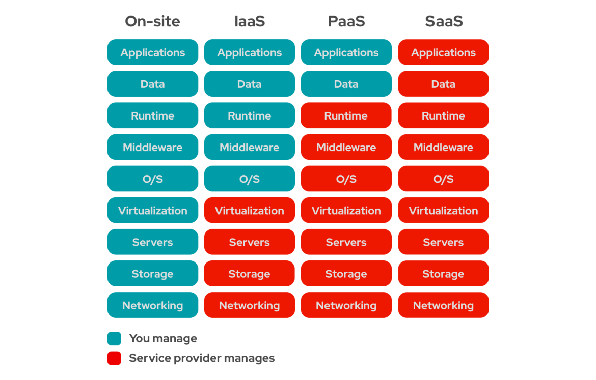
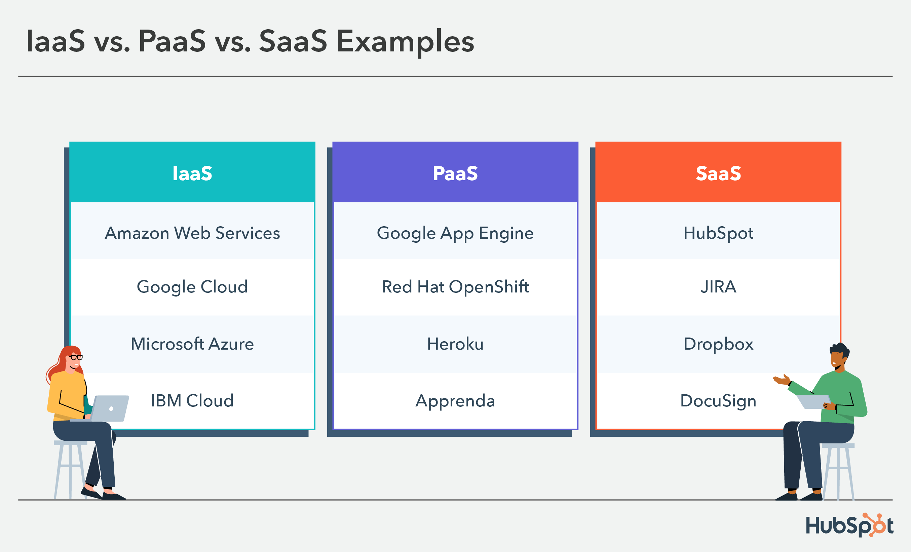
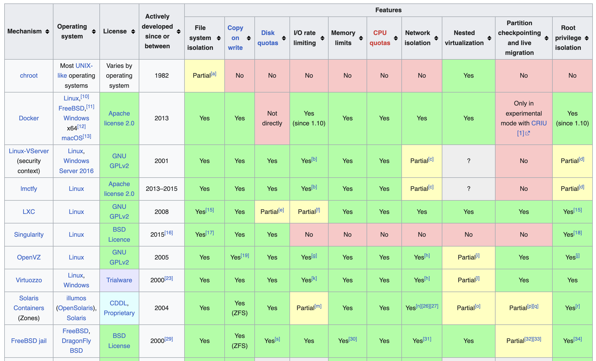
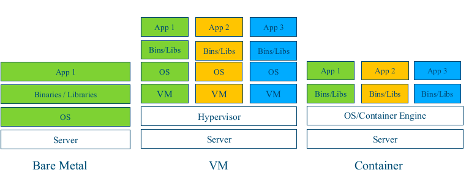
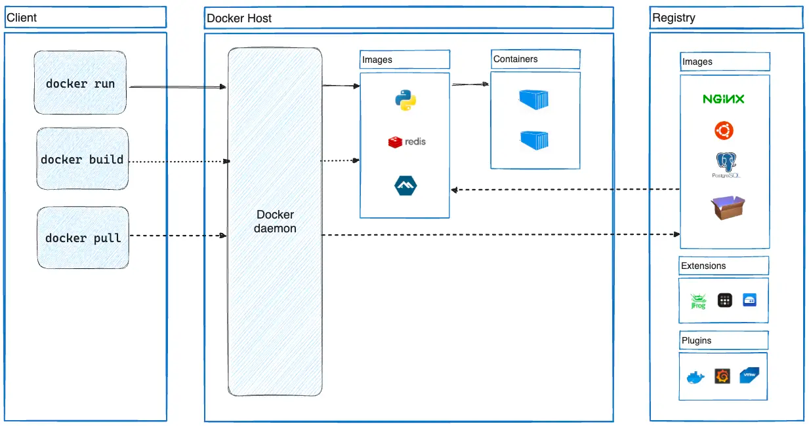
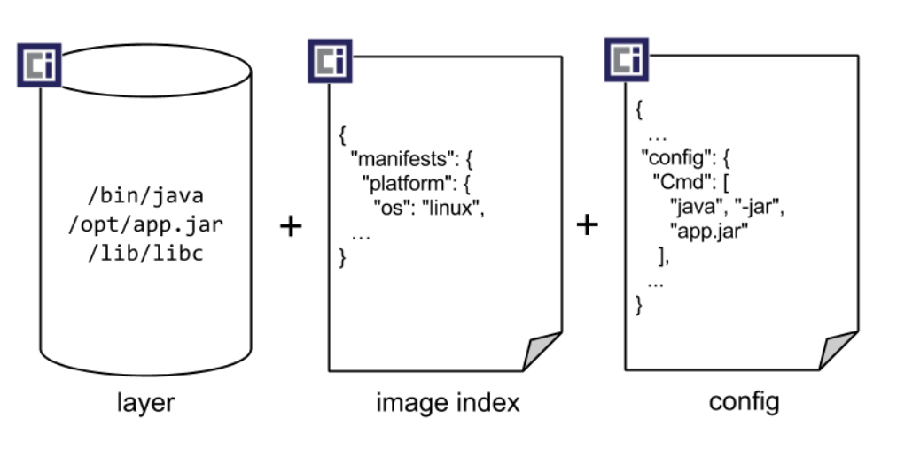
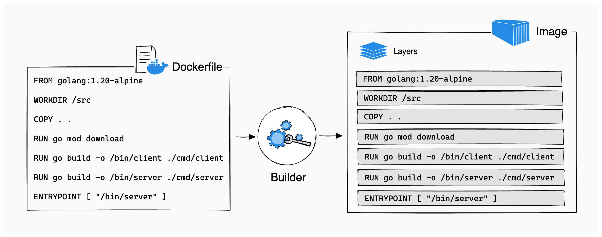
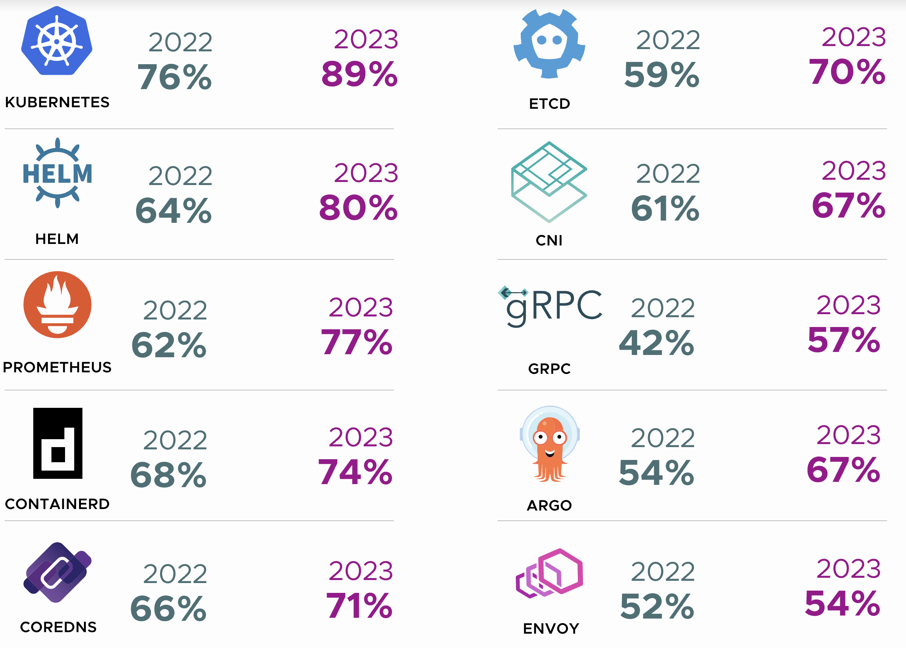
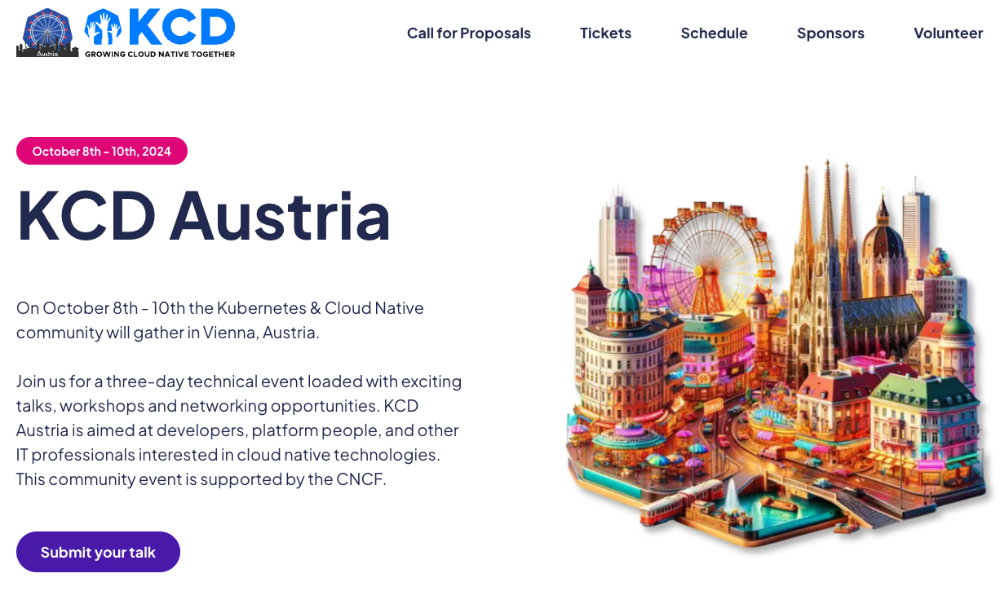
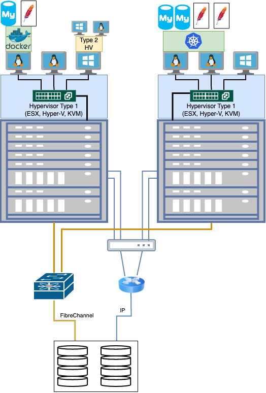

summary: BITI VICA - Containers
id: biti-vica-containers
categories: linux, virtualization, containers
tags: biti, vica, containers
status: Published
authors: Daniel Drack

# BITI VICA - Containers

<!-- ------------------------ -->

## Before We Begin

Welcome to Containers :-)

### What You’ll Learn

- Basics of Containers

### What You'll Need

- a notebook
- access to the internet
- a thirst for knowledge, a clear mind and an insatiable urge to learn

### Further Reading

- [KodeKloud](https://kodekloud.com/)
- [Linux Foundation LFS151x](https://training.linuxfoundation.org/training/introduction-to-cloud-infrastructure-technologies/)

## [1/12] [Sieber] Terraform

**Was ist Terraform?**
Terraform ist ein Open-Source-Infrastruktur-als-Code (IaC) Tool, das von HashiCorp entwickelt wurde. Es ermöglicht Nutzern, Infrastruktur auf einfache Weise zu definieren, bereitzustellen und zu verwalten. Durch die Verwendung von deklarativen Konfigurationsdateien kann Terraform verschiedene Cloud-Dienste und Ressourcen wie virtuelle Maschinen, Netzwerke und Datenbanken orchestrieren.

**Hauptmerkmale:**
1. **Deklarative Konfiguration:**
   Terraform verwendet eine deklarative Sprache namens HashiCorp Configuration Language (HCL), um die gewünschte Infrastruktur zu definieren. Anstatt Schritt für Schritt zu beschreiben, wie Ressourcen erstellt werden sollen, gibt der Nutzer den Endzustand an, und Terraform kümmert sich um die Umsetzung.

2. **Multi-Cloud und Hybrid-Cloud-Unterstützung:**
   Terraform unterstützt eine Vielzahl von Cloud-Anbietern wie AWS, Azure, Google Cloud, sowie On-Premises-Lösungen und bietet damit eine einheitliche Schnittstelle für das Management unterschiedlicher Infrastrukturumgebungen.

3. **Planungs- und Änderungsmanagement:**
   Mit Terraform können Nutzer geplante Änderungen überprüfen, bevor sie angewendet werden. Der `terraform plan` Befehl zeigt eine Vorschau der bevorstehenden Änderungen, während `terraform apply` die tatsächlichen Änderungen an der Infrastruktur vornimmt.

4. **Modularität und Wiederverwendbarkeit:**
   Terraform unterstützt die Erstellung von Modulen, die wiederverwendbare Konfigurationskomponenten darstellen. Dies fördert die DRY-Prinzipien (Don't Repeat Yourself) und erleichtert die Verwaltung komplexer Infrastrukturen.

**Vorteile von Terraform:**
- **Automatisierung und Effizienz:** Durch die Automatisierung der Infrastrukturverwaltung reduziert Terraform manuelle Eingriffe und minimiert menschliche Fehler.
- **Konsistenz und Wiederholbarkeit:** Da die Infrastruktur als Code behandelt wird, können Konfigurationen versioniert und wiederholt bereitgestellt werden.
- **Zusammenarbeit:** Teams können gemeinsam an denselben Terraform-Dateien arbeiten und Änderungen durch Versionskontrollsysteme wie Git nachverfolgen.
- **Skalierbarkeit:** Terraform erleichtert die Verwaltung von Infrastrukturen in großem Maßstab und unterstützt die schnelle Anpassung an wachsende Anforderungen.

**Herausforderungen:**
- **Einarbeitungszeit:** Die Lernkurve für Terraform kann steil sein, insbesondere für Nutzer, die neu in der IaC-Welt sind.
- **Komplexität bei großen Projekten:** Bei sehr umfangreichen Infrastrukturprojekten kann das Management der Terraform-Dateien und -Module komplex werden.

**Anwendungsfälle:**
- **Cloud-Migration:** Automatisierte Bereitstellung und Verwaltung von Ressourcen in der Cloud.
- **DevOps:** Integration in CI/CD-Pipelines zur kontinuierlichen Bereitstellung und Verwaltung von Infrastruktur.
- **Disaster Recovery:** Schnelle Wiederherstellung von Infrastruktur durch reproduzierbare Konfigurationsdateien.

### Feedback

Fragen:

- Was bedeutet "open source"? Warum ist Terraform zzt. ein brennendes Beispiel in der FOSS Domäne?

Anmerkung:

- Bilder wären hier gut gewesen
- Zusammenfassung/Erklärung passt gut

## [2/12] [Scheifinger] What does "Cloud Native" mean?

### Definition

Cloud Native bezieht sich auf die Gestaltung, Entwicklung und den Betrieb von Anwendungen unter Verwendung von bestimmten Technologie Stacks. 
Der Begriff ist eng mit Technologien wie Microservices, Containern und dynamischen Orchestrierern verbunden. 
Die Cloud Native Computing Foundation ist ein Projekt der Linux Foundation und steht hinter dem Begriff. 
Sie führen eine Liste an Cloud Native Applikationen, zu finden unter [CNCF Landscape](https://landscape.cncf.io/). 
Dort findet man alle Applikationen und Tools die mit Cloud Native zu tun haben.

### Wichtige Begriffe
 
- **Microservices**: Anwendungen werden als Sammlung kleiner, unabhängiger Dienste entwickelt.
- **Containerisierung**: Anwendungen und ihre Abhängigkeiten werden in Containern bereitgestellt, die sich leicht verschieben und skalieren lassen.
- **Dynamische Orchestrierung**: Automatisiertes Management, Skalierung und Optimierung von Container-Anwendungen.

### Vorteile
 
- **Skalierbarkeit**: Einfaches Bereitstellen oder löschen von Ressourcen nach Bedarf und Anforderungen.
- **Flexibilität**: Hohe Anpassungsfähigkeit an Geschäftsanforderungen und schnelle Anpassung Möglichkeit.
- **Robustheit**: Verbesserte Ausfallsicherheit und Verfügbarkeit durch dezentralen und redundanten Aufbau.

### Nachteile

- **Komplexität**: CN-Architekturen sind oft komplex in der Handhabung, besonders wenn die Deployments in die Größe wachsen.
- **Sicherheit**: In Verteilten Systemen ist es schwieriger gewisse Sicherheitsstandards einzuhalten.
- **Kosten und Kostenmanagement**: Einerseits können die Kosten sehr schnell nach oben gehen, weiters ist es oft nicht einfach die Kosten unter Kontrolle zu halten. Vorallem bei automatisch skalierenden Anwendungen.

### Beispiele von Software die in Verwendung ist:

- **Kubernetes**: Ein Orchestrierungstool für die Automatisierung der Bereitstellung, Skalierung und Verwaltung von Containeranwendungen.
- **Docker**: Eine Plattform für Entwickler und Sysadmins zur Erstellung, Bereitstellung und Ausführung von Anwendungen in Containern.
- **Argo**: CI/CD Tool für das Deployment.
- **Longhorn**: Verteilte Speicherlösung für Kubernetes.
- **Qdrant**: Vector Database for AI Applications.
- **Helm**: Ein Kubernetes Package Manager.

### Trends

- **Serverless**: Diese Technologie stellt eine Weiterentwicklung des Cloud-Native-Ansatzes dar. Sie ermöglicht es Entwicklern, sich voll und ganz auf das Schreiben von Code zu konzentrieren, ohne sich Gedanken über die zugrundeliegende Infrastruktur machen zu müssen.
- **Edge Computing**: Hierbei handelt es sich um eine Technik, bei der die Datenverarbeitung näher an den Ort der Datenerzeugung verlagert wird. Dies reduziert die Latenzzeiten erheblich und steigert die Effizienz.

### Feedback

Fragen:

- Werden bei "cloud-native" andere/neuere Technologien wie vor 10 Jahren verwendet?
Programmiersprachen, Protokolle, ...

Anmerkung:

- Microservices müssen nicht "unabhängig" sein
- siehe [Cloud Native Definition CNCF](https://github.com/cncf/toc/blob/main/DEFINITION.md)
- 👍 Trends/Beispiele

## [3/12] [Raab] HCI

#HW

![[traditional-converged-hyperconverged.jpg]]
### Überblick

Hyperkonvergente Infrastruktur (HCI) ist eine softwaredefinierte IT-Infrastruktur, die Compute, Speicher und Netzwerk in ein einziges System integriert. Sie abstrahiert Hardware-Ressourcen und verwaltet sie über Software, um eine hoch skalierbare und flexible Infrastrukturlösung bereitzustellen.

&nbsp
### Hauptkomponenten

- **Compute:** Virtualisierte Rechenressourcen, verwaltet durch einen Hypervisor wie VMware vSphere oder Microsoft Hyper-V.
- **Speicher:** Softwaredefinierte Speicher-Pools, aggregiert aus lokalen Speichergeräten über alle Knoten im HCI-Cluster.
- **Netzwerk:** Virtualisierte Netzwerkressourcen zur Kommunikation zwischen den Knoten und externen Netzwerken.

&nbsp
### Vorteile

- **Einfachheit:** Konsolidiert Hardware und Managementaufgaben in einer einzigen Plattform und reduziert so die Komplexität.
- **Skalierbarkeit:** Einfaches Skalieren durch Hinzufügen von Knoten zum Cluster, um Leistungs- und Kapazitätswachstum sicherzustellen.
- **Flexibilität:** Ermöglicht agile Ressourcenzuweisung und Workload-Migration über die Infrastruktur hinweg.
- **Widerstandsfähigkeit:** Integrierte Redundanz- und Datenreplikationsmechanismen verbessern den Datenschutz und die hohe Verfügbarkeit.

&nbsp
### Anwendungsfälle

- **Virtualisierung:** Ausführen von virtuellen Maschinen und Anwendungen in einer hoch effizienten und konsolidierten Umgebung.
- **Private Cloud:** Aufbau von privaten Cloud-Umgebungen mit integriertem Compute, Speicher und Netzwerk.
- **Edge Computing:** Bereitstellung von HCI an entfernten Standorten oder Edge-Umgebungen für verteilte Rechenanforderungen.
- **VDI:** Unterstützung von Virtual Desktop Infrastructure (VDI)-Implementierungen für Desktop-Virtualisierung.

&nbsp
### Beispiele

- **VMware vSAN:** VMwares HCI-Lösung, die sich nahtlos in VMware vSphere für virtualisierte Umgebungen integriert.
- **Nutanix:** Ein führender Anbieter von HCI-Lösungen, die Software-definierte Infrastrukturlösungen für verschiedene Workloads bieten.
- **Microsoft Azure Stack HCI:** Microsofts HCI-Angebot, optimiert für Windows Server und Azure-Integration.

### Feedback

Fragen:

- Was ist VDI? Unterschied/Gemeinsamkeit zu VM?

Anmerkung:

- vSan ist Storage, vSphere ist die gesamte HCI Lösung

## [4/12] [Guttmann] Virtuelle Maschinen

Virtuelle Maschinen (VMs) sind Replikationen physischer Computer, die es ermöglichen, mehrere Betriebssysteminstanzen auf einem einzigen physischen Host-Computer auszuführen. 
Jede VM verhält sich wie ein eigenständiger Computer mit eigener CPU, RAM, Festplatte und Netzwerkverbindung.

### Wie funktionieren VMs?

VMs werden durch Virtualisierungssoftware wie VMware, VirtualBox oder Hyper-V erstellt.
Mithilfe dieser Software ist es möglich virtuelle Maschinen auf dem Host-System bereitzustellen. 

### Vorteile von Virtuellen Maschinen:

- **Ressourcenoptimierung:** Durch die Bereitstellung mehrerer virtueller Maschinen auf einem einzigen physischen Host können Ressourcen effizienter genutzt werden.
  
- **Isolierung:** Jede virtuelle Maschine ist isoliert von anderen VMs und dem Host-Betriebssystem, was die Sicherheit und Stabilität verbessert.

- **Flexibilität:** Benutzer können verschiedene Betriebssysteme und Softwarekonfigurationen auf derselben Hardware ausführen, ohne physische Computer wechseln zu müssen.

- **Skalierbarkeit:** VMs können ganz leicht geklont und so höher skaliert werden.

### Nachteile von Virtuellen Maschinen:

- **Overhead:** Da VMs eine komplette physische Umgebung simulieren werden mehr Ressourcen genutzt, als womöglich von der Anwendung verlangt werden (anders als Container).

- **Komplexität:** Die Verwaltung und Konfiguration von virtuellen Maschinen und dazugehörigen Infrastruktur kann komplex sein und erfordert spezielle Kenntnisse.

- **Abhängigkeit vom Hostsystem:** Die Leistung und Stabilität der virtuellen Maschinen können von der Leistung und Stabilität des Host-Betriebssystems beeinflusst werden. Außerdem besteht das Risiko, dass wenn das Hostsystem nicht mehr verfügbar ist auch alle VMs auf dem System nicht mehr funktionieren.

### Anwendungsfälle:

- **Serverbereitstellung:** Unternehmen können mehrere Server auf einer einzigen physischen Maschine bereitstellen, was die Betriebskosten senkt.

- **Entwicklung und Testen:** Entwickler können verschiedene Umgebungen für die Softwareentwicklung und Tests erstellen, ohne physische Hardware bereitstellen zu müssen.

- **Cloud Computing:** Cloud-Plattformen verwenden VMs, um skalierbare und flexible Dienste anzubieten.

### Schlussfolgerung:

VMs sind eine leistungsstarke Technologie, die es ermöglicht, Ressourcen effizient zu nutzen, Flexibilität bietet und Kosten senkt. 
Durch die Erstellung mehrerer virtueller Maschinen auf einem einzigen Host-System bietet diese Technologie eine Vielzahl von Anwendungsmöglichkeiten für Unternehmen und Entwickler.

### Feedback

Fragen:

- Mögliche Probleme beim Clonen/Kopieren von VMs?
- Balloon-Treiber?
- Was muss gegeben sein, damit sich die Virtualisierung von Computern finanziell rechnet?

Anmerkung:

- Bilder wären hier gut gewesen

## [5/12] [Böhm] GDPR/DSGVO

**Datenschutz-Grundverordnung (DSGVO)**

Die Datenschutz-Grundverordnung (DSGVO) ist eine EU-Verordnung, die darauf abzielt, den Schutz personenbezogener Daten innerhalb der Europäischen Union zu stärken und zu vereinheitlichen.

**Wichtige Punkte:**

1. **Anwendungsbereich:** gilt für alle Unternehmen, die personenbezogene Daten von EU-Bürgern verarbeiten
    
2. **Grundsätze der Verarbeitung:** Die Verarbeitung personenbezogener Daten muss auf rechtmäßige, faire und transparente Weiße erfolgen. Es müssen bestimmte Zwecke festgelegt und die Daten auf das erforderliche Minimum beschränkt werden.
    
3. **Rechte der betroffenen Personen:** stärkt die Rechte der Einzelpersonen in Bezug auf ihre personenbezogenen Daten, einschließlich des Rechts auf Zugang, Berichtigung, Löschung und Widerspruch.
    
4. **Privacy by Design und Privacy by Default:** Unternehmen müssen von Anfang an Datenschutz in ihre Produkte und Dienstleistungen integrieren.
    
5. **Meldepflicht bei Datenschutzverletzungen:** Datenschutzverletzungen müssen innerhalb von 72 Stunden an die zuständige Aufsichtsbehörde gemeldet werden, es sei denn, die Verletzung ist ein geringes Risiko für die Rechte und Freiheiten von Einzelpersonen oder bereits angemessene technische und organisatorische Schutzmaßnahmen wurden ergriffen
    
6. **Sanktionen:** Bei Verstößen können Geldstrafen von bis zu 20 Millionen Euro oder bis zu 4% des weltweiten Jahresumsatzes des vorangegangenen Geschäftsjahres verhängt werden, je nachdem, welcher Betrag höher ist.

**Fazit:**

Die DSGVO hat die Art und Weise, wie Unternehmen personenbezogene Daten verarbeiten, grundlegend verändert. Es ist von entscheidender Bedeutung, dass Unternehmen die Bestimmungen der Verordnung einhalten, um sowohl die Rechte der Einzelpersonen als auch ihre eigenen Interessen zu schützen.

### Feedback

Fragen:

- An wen muss in Österreich eine Datenschutzverletzung gemeldet werden?

Anmerkung:

- gut zusammengefasst

## [6/12] [Platzer] Selected Security Buzzwords of the Cloud

Im Bereich Cloud-Computing tauchen häufig bestimmte Sicherheits-Buzzwords auf.
Das Verständnis dieser Begriffe ist entscheidend, um die Sicherheitslandschaft effektiv zu navigieren.
Hier sind einige **wichtige** Buzzwords:

### 1. Zero Trust

**Vertraue Niemanden!!!** Zero Trust-Architektur geht davon aus, dass Bedrohungen sowohl von außerhalb als auch von
innerhalb des Netzwerks kommen können. 
Es erfordert eine strenge Identitätsüberprüfung für jede Person und jedes Gerät, das auf Ressourcen zugreifen möchte.

### 2. Encryption at Rest

**Konzept**: Datenschutz durch Verschlüsselung während der Speicherung.
Stellt sicher, dass Daten für unbefugte Benutzer unlesbar sind, indem sie verschlüsselt werden, wenn sie auf Festplatten
gespeichert sind.
Wesentlich zum Schutz sensibler Informationen in der Cloud.

### 3. Encryption in Transit

**Konzept**: Datenschutz während der Übertragung.  
Daten werden verschlüsselt, während sie zwischen Servern und Clients übertragen werden. 
Verhindert Abfangen und Abhören von Daten, die über Netzwerke übertragen werden.
**Beispiel:** End-to-End Encryption

### 4. Identity and Access Management (IAM)

**Konzept**: Verwaltung von Benutzeridentitäten und deren Zugriffsrechten.  
IAM-Frameworks stellen sicher, dass die richtigen Personen zur richtigen Zeit aus den richtigen Gründen auf die
richtigen Ressourcen zugreifen.
Wichtige Komponenten sind Authentifizierung, Autorisierung und Benutzerverwaltung.

### 5. Multi-Factor Authentication (MFA)

**Konzept**: Erhöhte Sicherheit durch mehrere Verifikationsschritte.
Erfordert zwei oder mehr Verifizierungsfaktoren, um Zugang zu erhalten.
Häufige Faktoren sind etwas, das man weiß ( Passwort), etwas, das man hat (Token), und etwas, das man ist (Biometrie).

### 6. Shared Responsibility Model

**Konzept**: Aufteilung der Sicherheitsverantwortungen zwischen Cloud-Anbieter und Kunde.  
Cloud-Anbieter verwalten die Sicherheit der Cloud-Infrastruktur, während Kunden für die Sicherheit ihrer Daten,
Identitäten, Anwendungen und Betriebssysteme innerhalb der Cloud verantwortlich sind.

### 7. Security Information and Event Management (SIEM)

**Konzept**: Echtzeitanalyse von Sicherheitswarnungen.  
SIEM-Systeme bieten zentrale Protokollierung und Echtzeitanalyse von Sicherheitswarnungen, die von Anwendungen und
Netzwerkhardware generiert werden. 
Sie helfen dabei, potenzielle Sicherheitsbedrohungen zu erkennen und darauf zu reagieren.

### 8. Data Loss Prevention (DLP)

**Konzept**: Schutz sensibler Daten vor unbefugtem Zugriff und Verlust.  
DLP-Strategien identifizieren, überwachen und schützen Daten in Nutzung, Bewegung und Speicherung. 
Sie verhindern versehentliche oder böswillige Datenlecks.

### 9. Endpoint Protection

**Konzept**: Sicherheitsmaßnahmen für Endgeräte.  
Schützt Geräte wie Laptops, Smartphones und Tablets vor Bedrohungen. 
Umfasst Antivirus, Anti-Malware und Firewall-Schutz.

### 10. API Security

**Konzept**: Schutz von Application Programming Interfaces (APIs).  
Stellt sicher, dass APIs sicher genutzt werden, indem Authentifizierung, Autorisierung, Verschlüsselung und Überwachung
implementiert werden, um Datenverletzungen und Missbrauch zu verhindern.

### Feedback

Fragen:

- Mögliche Probleme von SIEM Systemen?

Anmerkung:

- 👍 gute Liste/guter Inhalt

## [7/12] [Marku] Benefits and examples of doing things as Code

„Doing things as code“ bezieht sich auf die Automatisierung von Prozessen, Konfigurationen und
Bereitstellungen mithilfe von Code anstelle manueller Eingriffe.

*Clean-up und Ressourcenoptimierung:*
Durch die Ausführung von Bereinigungsprozessen als Code können nicht benötigte Ressourcen automatisch erkannt und
bereinigt werden, was Kosten senkt und die Effizienz verbessert.

*Automatisierung durch Infrastruktur als Code (IaC):*
Durch die Verwendung von Tools wie Terraform, Ansible oder AWS CloudFormation ist es möglich die Infrastruktur als Code
zu definieren.
Die IaC Automatisierung beschleunigt den Prozess zur Einrichtung von Infrastruktur für Entwicklung, Tests und
Produktion und dadurch werden Infrastrukturressourcen wie virtuellen Maschinen, Netzwerken und Speicher reproduzierbar,
skalierbar und weniger fehleranfällig.

*Kontinuierliche Integration und Bereitstellung (CI/CD):*
Die Automatisierung von Build-, Test- und Bereitstellungsprozessen mithilfe von CI/CD-Pipelines ermöglicht es schnellere
Iterationen durchzuführen und eine höhere Softwarequalität zu gewährleisten.
Beliebte Tools wie Jenkins oder GitLab CI kommen im Einsatz.

*Versionierung und Testautomatisierung:*
Die Verwendung von Versionskontrollsystemen wie Git in Verbindung mit Testautomatisierungstools wie Selenium oder JUnit
ermöglicht es, Änderungen zu verfolgen, zu überprüfen und automatisierte Tests durchzuführen, um die Softwarequalität
sicherzustellen.

*Sicherheitsrichtlinie als Code:*
Definition von Sicherheitsrichtlinien und -konfigurationen mithilfe von Code, um Compliance-Checks, Schwachstellen-Scans
und die Durchsetzung von Sicherheitsstandards für Anwendungen und Infrastrukturen zu automatisieren.

*Risikominimierung und Wiederhertellbarkeit:*
Die Verwendung von Code ermöglicht eine präzise Dokumentation und Wiederherstellbarkeit von Systemzuständen.
Im Falle eines Fehlers oder Ausfalls ist es möglich schnell auf frühere Versionen zurückgreifen oder den Code
anpassen, um Probleme zu beheben, was das Risiko von Ausfallzeiten reduziert und die Wiederherstellbarkeit verbessert.

*Konsistenz:*
„Doing things as code“ stellt sicher, dass Prozessen, Konfigurationen und Bereitstellungen die vordefinierten Standards
und bewährten Verfahren entsprechen.

*Überprüfbarkeit:*
Automatisierte Prozesse hinterlassen eine klare Spur der durchgeführten Aktionen, was es einfacher macht, Probleme zu
überprüfen und zu beheben.

*Bessere Zusammenarbeit:*
Die IAC fördert eine bessere Zusammenarbeit zwischen IT-Teams, indem sie die gleichen Versionskontroll-, Test- und
Bereitstellungspraktiken wie Softwareentwickler verwendet.
Dadurch können IT-Teams effektiver zusammenarbeiten, die Kommunikation verbessern und das Fehlerrisiko verringern.

### Quellen:

- https://www.linkedin.com/pulse/benefits-iac-infrastructure-management-cloudmatos/
- https://www.ibm.com/de-de/topics/infrastructure-as-code
- https://thorntech.com/infrastructureascodebenefits/

### Feedback

Fragen:

- CI/CD?
- Nachteile von "as code"?

Anmerkung:

- Rechtschreibung beachten
- PDF eingereicht, kein Markdown
- Quellen 👍

## [8/12] [Nährer] Role-Based Access Control (RBAC)

RBAC ist ein Ansatz zur Zugriffskontrolle, bei dem Berechtigungen an Rollen anstatt an individuelle Benutzer vergeben
werden.

### Vorteile von RBAC:

- **Einfachheit:** Reduziert die Komplexität der Zugriffsverwaltung, indem Berechtigungen an Rollen zugewiesen werden.
- **Skalierbarkeit:** Ermöglicht eine einfache Skalierung der Zugriffsverwaltung, insbesondere in großen Organisationen.
- **Sicherheit:** Durch die Zuweisung von Rollen können Berechtigungen granular gesteuert und Missbrauch reduziert
  werden.

### Kernkonzepte von RBAC:

1. **Rollen:** Definieren die Gruppen von Benutzern mit ähnlichen Zugriffsrechten.
2. **Berechtigungen:** Definieren die spezifischen Aktionen, die eine Rolle ausführen kann.
3. **Benutzerzuweisungen:** Weisen Benutzer bestimmten Rollen zu, um ihnen entsprechende Zugriffsrechte zu gewähren.

### Implementierung von RBAC:

- **Rollen definieren:** Identifizieren Sie die verschiedenen Rollen in Ihrer Organisation und die damit verbundenen
  Berechtigungen.
- **Benutzer verwalten:** Weisen Sie Benutzern Rollen zu, basierend auf ihren Aufgaben und Verantwortlichkeiten.
- **Berechtigungen zuweisen:** Weisen Sie den Rollen die entsprechenden Berechtigungen basierend auf den Anforderungen
  zu.

### Beispiel:

| Rolle         | Berechtigungen                |
|---------------|-------------------------------|
| Administrator | Alle Zugriffsrechte           |
| Mitarbeiter   | Lesen und Schreiben von Daten |
| Gast          | Lesen von Daten               |

### Beispiele für RBAC-Systeme:

1. **Microsoft Active Directory (AD):** AD bietet umfangreiche Unterstützung für RBAC und ermöglicht die Verwaltung von
   Benutzerkonten, Gruppen und Berechtigungen in Windows-Umgebungen.

2. **Amazon Web Services (AWS) IAM:** IAM (Identity and Access Management) von AWS ermöglicht die feine Steuerung von
   Zugriffsrechten auf AWS-Ressourcen durch die Zuweisung von Rollen, Richtlinien und Berechtigungen.

3. **Google Cloud IAM:** Ähnlich wie AWS IAM ermöglicht Google Cloud IAM die Verwaltung von Identitäten und Zugriff auf
   Google Cloud-Ressourcen über Rollen und Richtlinien.

4. **OpenStack Keystone:** Keystone ist das Identity-Service-Projekt von OpenStack, das RBAC für die Authentifizierung
   und Autorisierung von Benutzern in OpenStack-basierten Cloud-Infrastrukturen bereitstellt.

5. **Oracle Identity Management:** Oracle bietet eine umfangreiche Identity-Management-Lösung, die RBAC-Funktionen für
   die Verwaltung von Benutzern, Gruppen und Zugriffsrechten in Oracle-Produkten und -Systemen bereitstellt.

6. **IBM Security Identity Manager:** Dieses Produkt von IBM bietet Funktionen für Identitätsverwaltung und
   Zugriffskontrolle, einschließlich RBAC-Funktionen zur Definition von Rollen und Berechtigungen.

### Fazit:

RBAC bietet eine effektive Methode zur Verwaltung von Zugriffsrechten in komplexen Systemen, indem es die
Zugriffsverwaltung vereinfacht, die Sicherheit erhöht und die Skalierbarkeit verbessert.

### Feedback

Fragen:

- IAM?
- Authentifizierung und Autorisierung?

Anmerkung:

- bei ChatGPT Formulierungen im Passiv wählen
- Gruppen sollten Rollen erhalten, nicht Benutzer
- Beispiele 👍

## [9/12] [Kirschner]

## [10/12] [Ivancsits] Infrastructure as Code (IaC) - Überblick

### Was ist IaC?

Infrastructure as Code (IaC) bedeutet, dass wir unsere IT-Infrastruktur mithilfe von Code verwalten. 
Anstatt manuell Einstellungen vorzunehmen, schreiben wir Code, der automatisch alles erledigt. 
Somit können Konfigurationen schneller und konsistenter erledigt werden.

### Vorteile von IaC

- **Skalierbarkeit:** Ermöglicht die einfache Skalierung von Infrastrukturressourcen, indem sie wiederholbare und konsistente Bereitstellungen ermöglicht.
- **Konsistenz:** Garantiert eine konsistente Konfiguration der Infrastruktur über verschiedene Umgebungen hinweg.
- **Versionierung:** Ermöglicht die Versionierung der Infrastrukturkonfiguration, was die Nachverfolgbarkeit und Wiederherstellbarkeit verbessert.
- **Schnelligkeit:** Beschleunigt die Bereitstellung von Infrastrukturressourcen durch Automatisierung und Wiederverwendung von Code.

### Tools

- **Terraform:** Es erlaubt uns, Infrastruktur über verschiedene Cloud-Provider hinweg zu verwalten.
- **Ansible:** Damit können wir Server konfigurieren und verwalten, ohne zusätzliche Software installieren zu müssen.
- **Pulumi:** ist ein IaC-Tool, das es Entwicklern ermöglicht, Infrastruktur mit beliebten Programmiersprachen wie Python und JavaScript definieren.

### Best Practices für IaC

- **Tests:** Implementieren Sie automatisierte Tests für Ihre Infrastrukturkonfiguration, um die Zuverlässigkeit sicherzustellen.
- **Code-Review:** Führen Sie Code-Reviews für Ihre IaC-Konfiguration durch, um Best Practices zu fördern und potenzielle Probleme frühzeitig zu identifizieren.

### Fazit

IaC bietet eine effiziente Möglichkeit, Infrastrukturressourcen zu verwalten und zu automatisieren. 
Durch die Verwendung von Code können Teams die Bereitstellung beschleunigen, die Konsistenz verbessern und die Skalierbarkeit ihrer Infrastruktur erhöhen.

### Feedback

Fragen:

- Unterschied von "Infrastruktur as Code" und "Configuration as Code"?
- Wie funktioniert Versionierung bei IaC?
- Warum können mit Ansible Server konfiguriert und verwaltet werden, ohne zusätzliche Software installieren zu müssen?

Anmerkung:

- ChatGPT Output im Passiv
- 👍 best practices & tools

## [11/12] [Dshandshgava] IaaS/PaaS/SaaS

IaaS, PaaS und SaaS sind die drei beliebtesten Arten von Cloud-Service-Angeboten.
Sie werden manchmal als Cloud-Service-Modelle oder Cloud-Computing-Service-Modelle bezeichnet.
"As-a-Service" bedeutet im Allgemeinen ein Cloud-Computing-Dienst, der von einem Drittanbieter bereitgestellt wird.
Mit jeder Art von Cloud Computing muss der Kunde immer weniger Infrastruktur vor Ort verwalten.

Die lokale IT-Infrastruktur stellt die größte Verantwortung für den Benutzer dar.
Was Cloud-Computing ermöglicht, ist die Zuweisung eines, mehrerer oder aller Teile der Infrastruktur an die Verwaltung
durch einen Drittanbieter, wodurch man sich auf andere Dinge konzentrieren kann.
IaaS, PaaS und SaaS schließen sich nicht gegenseitig aus.
Viele mittelständische Unternehmen nutzen mehr als eine dieser Optionen, und die meisten großen Unternehmen nutzen alle
drei.

### IaaS (Infrastructure-as-a-Service)

IaaS ist ein Pay-as-you-go-Service, bei dem ein Drittanbieter Infrastrukturdienste wie Speicherung und Virtualisierung
über das Internet bereitstellt, je nach Bedarf über eine Cloud.
Der Benutzer ist für das Betriebssystem sowie für Daten, Anwendungen, Middleware und Laufzeiten verantwortlich, während
der Anbieter Zugang zu Netzwerk, Servern, Virtualisierung und Speicherung sowie deren Verwaltung bietet.
Typischerweise können IaaS-Kunden zwischen VMs wählen, die auf gemeinsam genutzter physischer Hardware gehostet sind (
der Cloud-Dienstanbieter verwaltet die Virtualisierung) oder Bare-Metal-Server auf dedizierter physischer Hardware.
Kunden können die Server und Infrastrukturressourcen über ein grafisches Dashboard oder über
Anwendungsprogrammierschnittstellen (APIs) bereitstellen, konfigurieren und betreiben.

Im Vergleich zur traditionellen IT bietet IaaS Kunden mehr Flexibilität beim Aufbau von Rechenressourcen bei Bedarf und
bei der Skalierung nach oben oder unten in Reaktion auf Spitzen oder Verlangsamungen im Verkehr.
IaaS ermöglicht es Kunden, die Vorabkosten und den Overhead für den Kauf und die Wartung eines eigenen Rechenzentrums zu
vermeiden.
Es beseitigt auch den ständigen Kompromiss zwischen dem Kauf von überschüssiger Vor-Ort-Kapazität, um Spitzen zu
bewältigen, und der schlechten Leistung oder Ausfällen, die auftreten können, wenn nicht genügend Kapazität für
unvorhergesehene Verkehrsspitzen oder -wachstum vorhanden ist.

Die Hauptnachteile von IaaS sind die Möglichkeit von Sicherheitsproblemen des Anbieters, Mehrmandantensysteme, bei denen
der Anbieter Infrastrukturressourcen mit mehreren Kunden teilen muss, und die Zuverlässigkeit des Dienstes.
Diese Nachteile können vermieden werden, indem ein zuverlässiger und vertrauenswürdiger Anbieter mit einer soliden
Geschichte und Reputation ausgewählt wird.

Öffentliche Cloud-Anbieter wie AWS, Microsoft Azure und Google Cloud sind Beispiele für IaaS.

### PaaS (Platform-as-a-Service)

Bei PaaS hostet ein Anbieter die Hardware und Software auf seiner eigenen Infrastruktur und liefert diese Plattform dem
Benutzer als integrierte Lösung, Lösungsstapel oder Dienst über eine Internetverbindung.
PaaS ist hauptsächlich nützlich für Entwickler und Programmierer in dem es dem Benutzer ermöglicht, seine eigenen Apps
zu entwickeln, auszuführen und zu verwalten, ohne die Infrastruktur oder Plattform bauen und pflegen zu müssen, die
normalerweise mit dem Prozess verbunden ist.
Sie schreiben den Code, entwickeln und verwalten ihre Apps, aber ohne sich um Softwareupdates oder Hardwarewartung
kümmern zu müssen.
Die Umgebung zum Entwickeln und Bereitstellen wird für die Kunden bereitgestellt.
PaaS ist eine Möglichkeit, mit der Entwickler ein Framework erstellen können, um ihre webbasierten Anwendungen
anzupassen und zu erstellen.
Entwickler können integrierte Softwarekomponenten verwenden, um ihre Anwendungen zu erstellen, was die Menge an Code
reduziert, den sie selbst schreiben müssen.

Der Hauptvorteil von PaaS besteht darin, dass es Kunden ermöglicht, Anwendungen schneller und kostengünstiger zu
entwickeln, zu testen, bereitzustellen, auszuführen, zu aktualisieren und zu skalieren, als wenn sie ihre eigene lokale
Plattform aufbauen und verwalten müssten.

Einige Beispiele für PaaS sind AWS Elastic Beanstalk, Heroku und Red Hat OpenShift.

### SaaS (Software-as-a-Service)

Auch bekannt als Cloud-Anwendungsdienste, ist SaaS die umfassendste Form von Cloud-Computing-Diensten, die eine gesamte
Anwendung, die von einem Anbieter verwaltet wird, über einen Webbrowser bereitstellen.
Benutzer zahlen eine monatliche oder jährliche Gebühr, um eine vollständige Anwendung über einen Webbrowser,
Desktop-Client oder eine mobile App zu nutzen.
Die Anwendung und die gesamte Infrastruktur, die für deren Bereitstellung erforderlich ist – Server, Speicher, Netzwerk,
Middleware, Anwendungssoftware, Datenspeicherung – werden vom SaaS-Anbieter gehostet und verwaltet.
Software-Updates, Fehlerkorrekturen und allgemeine Softwarewartung werden vom Anbieter durchgeführt und der Benutzer
verbindet sich mit der App über ein Dashboard oder eine API.
Es ist keine Installation der Software auf einzelnen Maschinen erforderlich und der Gruppenzugriff auf das Programm ist
reibungsloser und zuverlässiger.
Der Hauptvorteil von SaaS besteht darin, dass es alle Infrastruktur- und Anwendungsverwaltungsaufgaben an den
SaaS-Anbieter auslagert.
Alles, was der Benutzer tun muss, ist ein Konto zu erstellen, die Gebühr zu zahlen und mit der Nutzung der Anwendung zu
beginnen.
Der Anbieter übernimmt alles andere, von der Wartung der Serverhardware und -software bis hin zur Verwaltung des
Benutzerzugriffs und der Sicherheit, der Speicherung und Verwaltung von Daten, der Implementierung von Upgrades und
Patches und mehr.

SaaS ist eine gute Option für kleine Unternehmen, die nicht über das Personal oder die Bandbreite verfügen, um die
Installation und Aktualisierung von Software zu bewältigen, sowie für Anwendungen, die nicht viel Anpassung erfordern
oder nur periodisch verwendet werden.
Was SaaS dem Benutzer an Zeit und Wartung spart, könnte jedoch Kontrolle, Sicherheit und Leistung kosten, daher ist es
wichtig.

Beispiele für SaaS sind Dropbox, Salesforce, Google Apps und Red Hat Insights.




### Quellen

https://www.redhat.com/en/topics/cloud-computing/iaas-vs-paas-vs-saas
https://www.ibm.com/topics/iaas-paas-saas

### Feedback

Fragen:

- Middleware?
- Red Hat Insights?

Anmerkung:

- Bilder zukünftig auch einfügen, nicht nur in zip geben
- Quellen 👍

## [12/12] [Vedanayagam]

## Containers Overview

> "Container-Technologie ist eine Methode der Virtualisierung, bei der Anwendungen zusammen mit ihren Abhängigkeiten in
> leichten, portablen und isolierten Umgebungen ausgeführt werden, die den Kernel des Host-Betriebssystems gemeinsam
> nutzen."
> -- ChatGPT

* OS-Virtualisierung!
* Container Runtime/Engine anstatt Hypervisor
* Schneller/Schlanker aber weniger mächtig (zB HW Unterstützung)

## Vertreter der Container Technologie

Aktuell sprechen wir meist von "Docker" oder OCI Container.



## Bare Metal vs VM vs Container



## Docker Architecture



## OCI Images

* VM Images sind HDD Snapshots die booten
* Container Images sind Umgebungen in denen ein Prozess startet

Images sind definiert strukturierte Verzeichnisse (und Archive daraus), die aus bestimmten Files und Unterverzeichnissen
verstehen.

* Daten (bins/libs)
* Konfiguration



```shell
$ cd example.com/app/
$ find . -type f
./index.json
./oci-layout
./blobs/sha256/3588d02542238316759cbf24502f4344ffcc8a60c803870022f335d1390c13b4
./blobs/sha256/4b0bc1c4050b03c95ef2a8e36e25feac42fd31283e8c30b3ee5df6b043155d3c
./blobs/sha256/7968321274dc6b6171697c33df7815310468e694ac5be0ec03ff053bb135e768
```

index.json

```json
[
  {
    "Id": "sha256:760b7cbba31e196288effd2af6924c42637ac5e0d67db4de6309f24518844676",
    "RepoTags": [
      "nginx:latest"
    ],
    "RepoDigests": [
      "nginx@sha256:c26ae7472d624ba1fafd296e73cecc4f93f853088e6a9c13c0d52f6ca5865107"
    ],
    "Parent": "",
    "Comment": "buildkit.dockerfile.v0",
    "Created": "2024-02-14T18:24:57Z",
    "DockerVersion": "",
    "Author": "",
    "Config": {
      "ExposedPorts": {
        "80/tcp": {}
      },
      "Env": [
        "PATH=/usr/local/sbin:/usr/local/bin:/usr/sbin:/usr/bin:/sbin:/bin",
        "NGINX_VERSION=1.25.4",
        "NJS_VERSION=0.8.3",
        "PKG_RELEASE=1~bookworm"
      ],
      "Cmd": [
        "nginx",
        "-g",
        "daemon off;"
      ],
      "WorkingDir": "",
      "Entrypoint": [
        "/docker-entrypoint.sh"
      ],
      "Labels": {
        "maintainer": "NGINX Docker Maintainers <docker-maint@nginx.com>"
      },
      "StopSignal": "SIGQUIT"
    },
    "Architecture": "arm64",
    "Os": "linux",
    "Size": 192018334,
    "RootFS": {
      "Type": "layers",
      "Layers": [
        "sha256:644fed2a38987e9c2e23a98fbd38f898ab6ab64c8473b9123bdd970bb77c1437",
        "sha256:a4a7249377c4083d36d2ec08b102aea75cdc04179bf12fdbb39fae2f756c8b01",
        "sha256:3ffa25f4073e11002b35800377340182a61d1454dba950dae07ab8e0bd1b55b0"
      ]
    },
    "Metadata": {
      "LastTagTime": "0001-01-01T00:00:00Z"
    }
  }
]
```

## Building Container Images / Dockerfile


Source: https://docs.docker.com/build/guide/layers/

## Demo: NGINX Dockerfile

```html
<!DOCTYPE html>
<html lang="en">
<head>
    <meta charset="UTF-8">
    <meta name="viewport" content="width=device-width, initial-scale=1.0">
    <title>Welcome to My Static Site</title>
    <style>
        body {
            font-family: Arial, sans-serif;
            text-align: center;
            padding: 50px;
        }

        h1 {
            color: #333366;
        }

        p {
            color: #666;
            font-size: 1.2em;
        }
    </style>
</head>
<body>
<h1>Welcome to My Static Site</h1>
<p>This is a simple static website served by Nginx inside a Docker container.</p>
</body>
</html>
```

```dockerfile
# Use the Nginx image from Docker Hub as the base image
FROM nginxinc/nginx-unprivileged:latest

# Copy the static website files to the Nginx server
COPY index.html /usr/share/nginx/html/index.html

# Expose port 80
EXPOSE 8080

# Start Nginx when the container launches
CMD ["nginx", "-g", "daemon off;"]
```

```bash
docker build -t my-website:latest .
docker run -p 8080:8080 my-website:latest
```

## Teaser: Container in real life

- Multi-Host Containers: Kubernetes
- Automate everything: Storage, Networking, Zertifikate, Routing, App Lifecycle,..

CNCF Projekte - in Produktion



## Cloud Native Austria / Kubernetes Community Days

- https://kcdaustria.at/



## Recap


