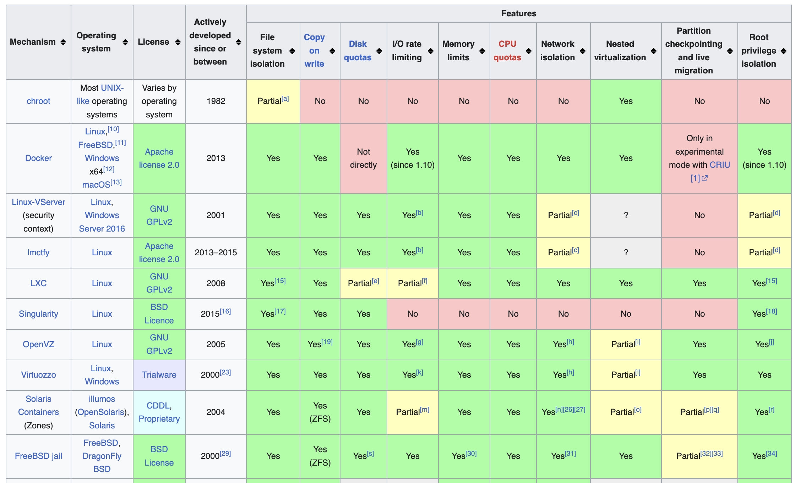
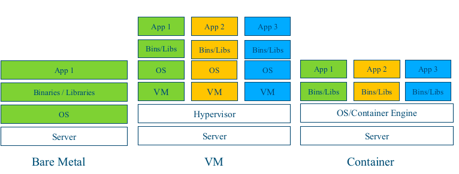
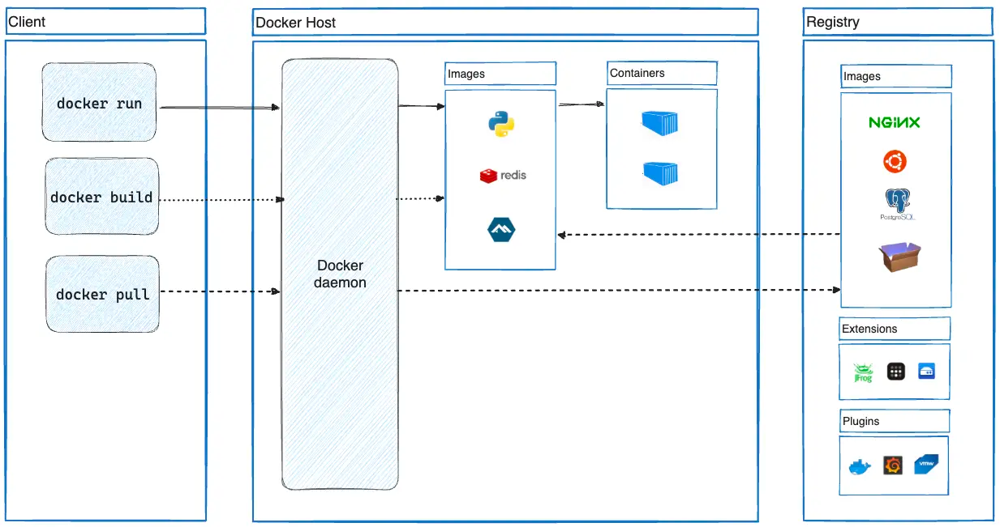
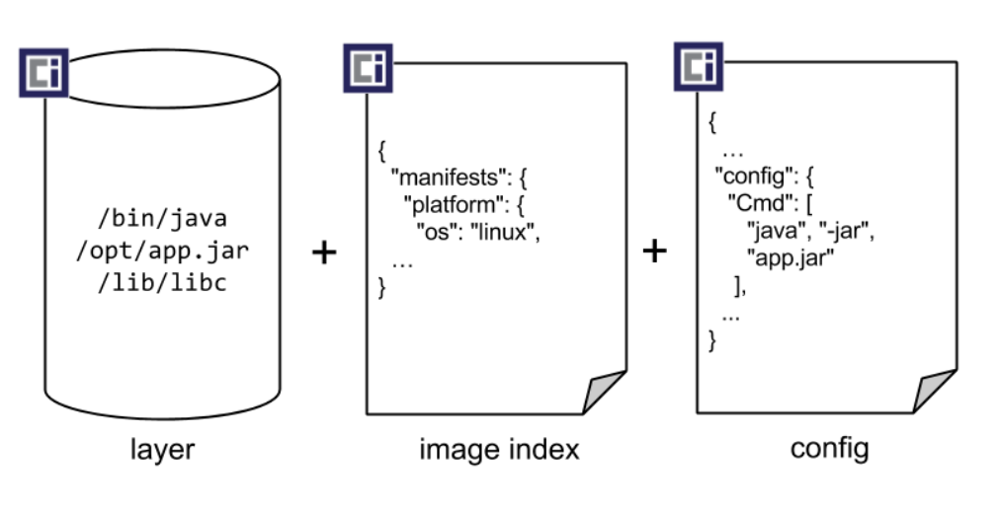
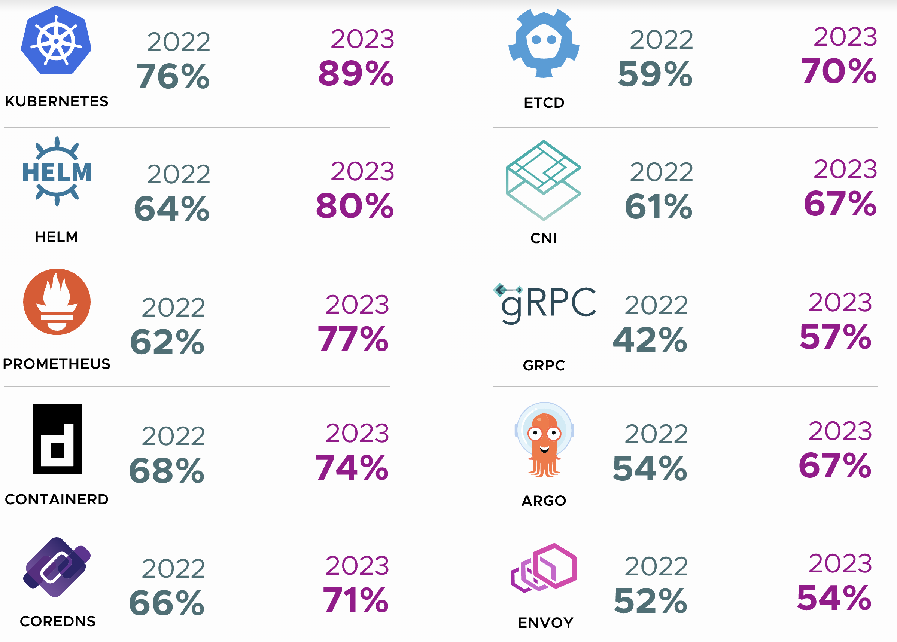
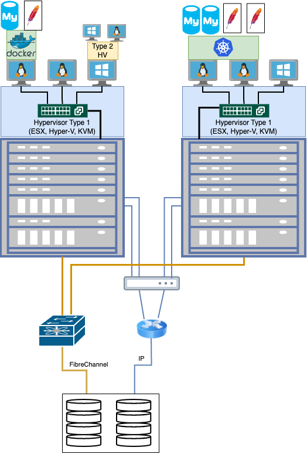

summary: BITI VICA - Containers
id: biti-vica-containers
categories: linux, virtualization, containers
tags: biti, vica, containers
status: Published
authors: Daniel Drack, BSc MA MBA

# BITI VICA - Containers

<!-- ------------------------ -->

## Before We Begin

Welcome to Containers :-)

### What You’ll Learn

- Basics of Containers

### What You'll Need

- a notebook
- access to the internet
- a thirst for knowledge, a clear mind and an insatiable urge to learn

### Further Reading

- [KodeKloud](https://kodekloud.com/)
- [Linux Foundation LFS151x](https://training.linuxfoundation.org/training/introduction-to-cloud-infrastructure-technologies/)

## Containers Overview

> "Container-Technologie ist eine Methode der Virtualisierung, bei der Anwendungen zusammen mit ihren Abhängigkeiten in
> leichten, portablen und isolierten Umgebungen ausgeführt werden, die den Kernel des Host-Betriebssystems gemeinsam
> nutzen."
> -- ChatGPT

* OS-Virtualisierung!
* Container Runtime/Engine anstatt Hypervisor
* Schneller/Schlanker aber weniger mächtig (zB HW Unterstützung)

## Vertreter der Container Technologie

Aktuell sprechen wir meist von "Docker" oder OCI Container.



## Bare Metal vs VM vs Container



## Docker Architecture



## OCI Images

* VM Images sind HDD Snapshots die booten
* Container Images sind Umgebungen in denen ein Prozess startet

Images sind definiert strukturierte Verzeichnisse (und Archive daraus), die aus bestimmten Files und Unterverzeichnissen
verstehen.

* Daten (bins/libs)
* Konfiguration



```shell
$ cd example.com/app/
$ find . -type f
./index.json
./oci-layout
./blobs/sha256/3588d02542238316759cbf24502f4344ffcc8a60c803870022f335d1390c13b4
./blobs/sha256/4b0bc1c4050b03c95ef2a8e36e25feac42fd31283e8c30b3ee5df6b043155d3c
./blobs/sha256/7968321274dc6b6171697c33df7815310468e694ac5be0ec03ff053bb135e768
```

index.json

```json
[
  {
    "Id": "sha256:760b7cbba31e196288effd2af6924c42637ac5e0d67db4de6309f24518844676",
    "RepoTags": [
      "nginx:latest"
    ],
    "RepoDigests": [
      "nginx@sha256:c26ae7472d624ba1fafd296e73cecc4f93f853088e6a9c13c0d52f6ca5865107"
    ],
    "Parent": "",
    "Comment": "buildkit.dockerfile.v0",
    "Created": "2024-02-14T18:24:57Z",
    "DockerVersion": "",
    "Author": "",
    "Config": {
      "ExposedPorts": {
        "80/tcp": {}
      },
      "Env": [
        "PATH=/usr/local/sbin:/usr/local/bin:/usr/sbin:/usr/bin:/sbin:/bin",
        "NGINX_VERSION=1.25.4",
        "NJS_VERSION=0.8.3",
        "PKG_RELEASE=1~bookworm"
      ],
      "Cmd": [
        "nginx",
        "-g",
        "daemon off;"
      ],
      "WorkingDir": "",
      "Entrypoint": [
        "/docker-entrypoint.sh"
      ],
      "Labels": {
        "maintainer": "NGINX Docker Maintainers <docker-maint@nginx.com>"
      },
      "StopSignal": "SIGQUIT"
    },
    "Architecture": "arm64",
    "Os": "linux",
    "Size": 192018334,
    "RootFS": {
      "Type": "layers",
      "Layers": [
        "sha256:644fed2a38987e9c2e23a98fbd38f898ab6ab64c8473b9123bdd970bb77c1437",
        "sha256:a4a7249377c4083d36d2ec08b102aea75cdc04179bf12fdbb39fae2f756c8b01",
        "sha256:3ffa25f4073e11002b35800377340182a61d1454dba950dae07ab8e0bd1b55b0"
      ]
    },
    "Metadata": {
      "LastTagTime": "0001-01-01T00:00:00Z"
    }
  }
]
```

## Building Container Images / Dockerfile


Source: https://docs.docker.com/build/guide/layers/

## Demo: NGINX Dockerfile

```html
<!DOCTYPE html>
<html lang="en">
<head>
    <meta charset="UTF-8">
    <meta name="viewport" content="width=device-width, initial-scale=1.0">
    <title>Welcome to My Static Site</title>
    <style>
        body {
            font-family: Arial, sans-serif;
            text-align: center;
            padding: 50px;
        }

        h1 {
            color: #333366;
        }

        p {
            color: #666;
            font-size: 1.2em;
        }
    </style>
</head>
<body>
<h1>Welcome to My Static Site</h1>
<p>This is a simple static website served by Nginx inside a Docker container.</p>
</body>
</html>
```

```dockerfile
# Use the Nginx image from Docker Hub as the base image
FROM nginxinc/nginx-unprivileged:latest

# Copy the static website files to the Nginx server
COPY index.html /usr/share/nginx/html/index.html

# Expose port 80
EXPOSE 8080

# Start Nginx when the container launches
CMD ["nginx", "-g", "daemon off;"]
```

```bash
docker build -t my-website:latest .
docker run -p 8080:8080 my-website:latest
```

## Teaser: Container in real life

- Multi-Host Containers: Kubernetes
- Automate everything: Storage, Networking, Zertifikate, Routing, App Lifecycle,..

CNCF Projekte - in Produktion



## Cloud Native Austria / Kubernetes Community Days

- https://kcdaustria.at/


## Recap


