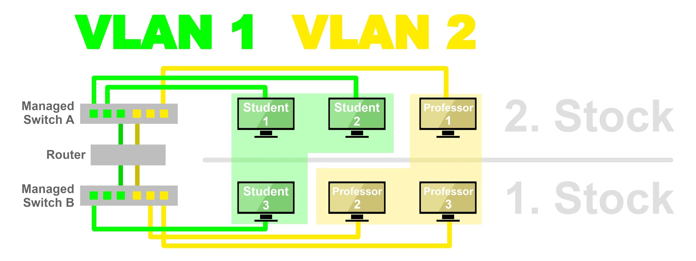
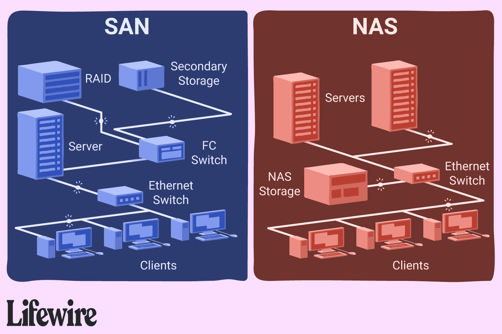

summary: BITI VICA - Virtual Machines and IaC
id: biti-vica-vm-iac
categories: linux, virtualization, iac
tags: biti, vica, iac
status: Published
authors: Daniel Drack

# BITI VICA - Virtual Machines and IaC

<!-- ------------------------ -->

## Before We Begin

Welcome to Virtual Machines and IaC :-)

### What You’ll Learn

- Basics of Virtual Machines and IaC
- Basics of ExoScale

### What You'll Need

- a notebook
- access to the internet
- `terraform` installed locally
- Exoscale access
- a thirst for knowledge, a clear mind and an insatiable urge to learn

### Further Reading

- [KodeKloud](https://kodekloud.com/)
- [Exoscale Docs](https://community.exoscale.com/)
- [HasciCorp Tutorials](https://developer.hashicorp.com/terraform/tutorials)
- [KCNA Cert](https://training.linuxfoundation.org/certification/kubernetes-cloud-native-associate/)
- [JetBrains Free Licenses](https://www.jetbrains.com/community/education/#students)

## [1/12] Performance Impact von Virtualisierung [Sieber]

**Einführung:** Virtualisierung ermöglicht die Ausführung mehrerer Betriebssysteme und Anwendungen auf einem einzelnen
physischen Server durch die Virtualisierung von Hardware-Ressourcen. Diese Technologie beeinflusst die Systemleistung in
vielfältiger Weise und erfordert eine sorgfältige Handhabung, um ihre Vorteile vollständig nutzen zu können.

**Verständnis der Virtualisierung:**

- **Hypervisoren:** Software, die virtuelle Maschinen (VMs) erstellt und verwaltet und als Plattform zur Virtualisierung
  der Hardware dient.
- **Arten der Virtualisierung:** Server-, Netzwerk- und Speichervirtualisierung, die jeweils unterschiedliche
  Auswirkungen auf die Leistung haben.

**Leistungsauswirkungen:**

1. **CPU-Leistung:**

    - **Overhead:** Hypervisoren verbrauchen CPU-Ressourcen, was einen Overhead erzeugt, der in nicht-virtualisierten
      Umgebungen nicht vorhanden ist.
    - **Ressourcenkonkurrenz:** Mehrere VMs, die um CPU-Zyklen konkurrieren, können zu Leistungseinbußen führen, sofern
      dies nicht angemessen verwaltet wird.
2. **Speichernutzung:**

    - **Zuweisungsgrenzen:** Jeder VM wird eine feste Menge an RAM zugewiesen, die, wenn überschritten, zu Swapping und
      erheblich langsamerer Leistung führt.
    - **Balloon-Treiber:** Hypervisoren verwenden Balloon-Treiber, um ungenutzten Speicher von VMs zurückzugewinnen, was
      Leistungsprobleme verursachen kann, wenn es nicht korrekt konfiguriert ist.
3. **Disk I/O:**

    - **Speichervirtualisierung:** Führt zusätzliche Abstraktionsebenen ein, erhöht potenziell die Latenz und verringert
      den I/O-Durchsatz.
    - **Geteilte Ressourcen:** VMs, die denselben physischen Speicher teilen, können insbesondere während Spitzenlasten
      I/O-Engpässe erleiden.
4. **Netzwerkdurchsatz:**

    - **Virtuelle Switches:** Der Netzwerkverkehr zwischen VMs auf demselben Host wird durch virtuelle Switches
      geleitet, was zusätzliche Latenz verursachen und den Durchsatz im Vergleich zu physischen Netzwerkswitches
      reduzieren kann.

**Techniken zur Leistungssteigerung:**

- **Angemessene Ressourcenzuweisung:** Zuweisung ausreichender CPU-, Speicher- und I/O-Ressourcen basierend auf den
  Leistungsanforderungen jeder VM.
- **Erweiterte Hypervisor-Funktionen:** Funktionen wie CPU-Pinning und I/O-Passthrough können helfen, den
  Virtualisierungs-Overhead zu minimieren und die Leistung zu verbessern.
- **Dynamische Ressourcenplanung:** Systeme wie VMwares DRS oder Microsofts Dynamic Memory helfen, die
  Ressourcenzuweisung in Echtzeit zu verwalten, um die Leistung zu optimieren.

**Herausforderungen bei der Virtualisierung:**

- **Überwachung und Verwaltung:** Erfordert anspruchsvolle Werkzeuge zur Leistungsüberwachung und effizienten
  Ressourcenverwaltung.
- **Komplexität:** Erhöhte Komplexität bei der Fehlerbehebung und der Aufrechterhaltung der Leistung über mehrere VMs
  und unterschiedliche Workloads hinweg.

## [2/12] NAS [Scheifinger]

---
aliases:

- Network Attached Storage
- NAS
  tags:
- FH/4/VICA/Virtualisierung

---

### Definition: Was ist ein NAS

Ein NAS (Network Attached Storage) Device ist ein Gerät, welches dazu ausgelegt ist, Daten zu speichern. Das Ziel eines
NAS ist es, eine zentrale, netzwerkbasierte Speicherlösung bereitzustellen, auf die mehrere Benutzer gleichzeitig
zugreifen können.

### Technische Aspekte

#### Hardware

Ein NAS besteht typischerweise aus mehreren Festplatten die zu einem Raid (RAID1, RAID5) zusammengeschalten werden. Dies
ist wichtig, damit die Datensicherheit und Redundanz gegeben ist. Es gibt auch NAS Lösungen, bei denen nur eine
Festplatte zum Einsatz kommt, dies vermindert jedoch einige Vorteile einer normalen NAS wie zum Beispiel die Spiegelung
der Daten über mehrere Festplatten.

#### Software

Die Software auf einem NAS darf auch nicht vernachlässigt werden. Diese ist dazu da, Speicherressourcen, Netzwerkdienste
und Zugriffskontrollen zu verwalten. Normalerweise unterstützt es auch eine Vielzahl von Protokollen für Dateizugriffe,
darunter SMB/CIFS, NFS und manchmal auch AFP.

### Funktionsweise

- Dateifreigabe
  Eines der Hauptzwecke ist die Dateifreigabe im Netzwerk. Dies erleichtert die Zusammenarbeit in Teams, dadurch die
  Daten an denen gearbeitet wird an einem zentralen Punkt gespeichert werden.
    - Beispiel: Büro
      Mitarbeiter können ihre Arbeitsdokumente auf einem NAS speichern. Dies ermöglicht es allen Beteiligten, von jedem
      Bürorechner aus auf die neuesten Versionen von den Dateien zuzugreifen.
- Multimedia-Server
  Viele Geräte haben einen integrierte Funktion, um Videos, Fotos und Audiodateien im Netzwerk zu streamen.
    - Beispiel: Zuhause
      Alle Familienmitglieder können auf eine gemeinsame Fotobibliothek für Familienfotos zugreifen
- Datensicherung
  Es besteht die Möglichkeit ein NAS als Backup-Ziel zu verwenden. Dort können Geräte automatisiert ihre Backups zum
  Beispiel Täglich um Mitternacht machen, ohne andere Geräte zu stören.

### Vorteile / Nachteile

| PRO                                      | CON                                        |
|------------------------------------------|--------------------------------------------|
| Einfacher Zugriff und gemeinsame Nutzung | Stromverbrauch                             |
| Zentralisierte Datensicherung            | Abhängigkeit von der Netzwerkinfrastruktur |
| Skalierbarkeit                           | Kosten für Erweiterung                     |
| Kosteneffizienz                          |                                            |

## [3/12] Buzzwords [Raab]

| Begriff                                        | Definition                                                                                                                                                                                                                                                                            |
|------------------------------------------------|---------------------------------------------------------------------------------------------------------------------------------------------------------------------------------------------------------------------------------------------------------------------------------------|
| **SAN (Storage Area Network)**                 | *Ein dediziertes Hochgeschwindigkeitsnetzwerk, das den Zugriff auf Speicher von mehreren Servern aus ermöglicht.*                                                                                                                                                                     |
|                                                |                                                                                                                                                                                                                                                                                       |
| **NAS (Network Attached Storage)**             | *Ein Dateispeichersystem, das über ein Netzwerk angeschlossen ist und   Dateizugriffsdienste für andere Geräte bereitstellt.*                                                                                                                                                         |
|                                                |                                                                                                                                                                                                                                                                                       |
| **Type 1 Hypervisor**                          | *Ein Hypervisor, der direkt auf der Hardware läuft, hostet virtuelle Maschinen ohne zugrunde-liegendes Betriebssystem, zB: VMWare, Hyper-V*                                                                                                                                           |
|                                                |                                                                                                                                                                                                                                                                                       |
| **Type 2 Hypervisor**                          | *Ein Hypervisor, der auf einem Betriebssystem installiert ist, führt virtuelle Maschinen als normale Anwendungen aus, zB: Oracle VirtualBox*                                                                                                                                          |
|                                                |                                                                                                                                                                                                                                                                                       |
| **VLAN (Virtual Local Area Network)**          | *Ein logisches Netzwerk, das Geräte in physisch getrennten Netzwerken miteinander verbindet, indem es die Ressourcen eines einzelnen physischen Netzwerks in mehrere virtuelle Netzwerke aufteilt.*                                                                                   |
|                                                |                                                                                                                                                                                                                                                                                       |
| **VXLAN (Virtual Extensible LAN)**             | *Ein Overlay-Netzwerkprotokoll, das Layer-2-Verbindungen über Layer-3-Netzwerke ermöglicht, um virtuelle Maschinen über Rechenzentren hinweg zu verbinden.*                                                                                                                           |
|                                                |                                                                                                                                                                                                                                                                                       |
| **SDN (Software-Defined Networking)**          | *Ein Netzwerkarchitekturansatz, bei dem die Steuerungsebene vom Datenverkehr getrennt ist und über eine zentrale Softwaresteuerung erfolgt.*                                                                                                                                          |
|                                                |                                                                                                                                                                                                                                                                                       |
| **OS Virtualization**                          | *Die Virtualisierung eines Betriebssystems, das es ermöglicht, mehrere Instanzen desselben Betriebssystems auf einem einzelnen Host auszuführen, zB: Docker*                                                                                                                          |
|                                                |                                                                                                                                                                                                                                                                                       |
| **Performance Impact with Virtualization**     | *Die Auswirkungen der Virtualisierung auf die Leistung von Anwendungen und Systemen, einschließlich Overhead und Ressourcenverwaltung, zB: Hyper-V ist in Windows Server integriert, was wiederum Leistungsverbesserungen bietet.*                                                    |
|                                                |                                                                                                                                                                                                                                                                                       |
| **Problems and Limitations of Virtualization** | *Herausforderungen und Einschränkungen bei der Implementierung und Nutzung von Virtualisierungstechnologien. Red Hat Enterprise Virtualization unterstützt Unternehmen dabei etwaige Herausforderungen bzgl Implementierung und Verwaltung virtualisierter Umgebungen zu bewältigen.* |
|                                                |                                                                                                                                                                                                                                                                                       |
| **History of Virtualization**                  | *Die Entwicklung und Evolution von Virtualisierungstechnologien seit ihren Anfängen bis zur heutigen Verbreitung.*<br>     * - begann in den 60er-Jahren mit IBM*<br>      *- Gründung von VMWare 1990*<br>     * - Corona Pandemie 2020*                                             |

## [4/12]  OS Virtualisierung [Guttmann]

### Was ist OS Virtualisierung?

OS Virtualisierung bezieht sich auf die Technik, bei der auf einem einzelnen physischen Host mehrere virtuelle Instanzen bereitgestellt werden können. Jede dieser virtuelle Maschinen (VMs) agiert unabhängig voneinander und kann verschiedene Betriebssysteme bereitstellen.

### Wie funktioniert OS Virtualisierung?

OS Virtualisierung wird durch eine Virtualisierungssoftware wie VMware, VirtualBox oder Hyper-V ermöglicht. Mithilfe dieser Software ist es möglich virtuelle Maschinen auf dem Host-System bereitzustellen. Jede VM verhält sich wie ein eigenständiger Computer mit eigener CPU, RAM, Festplatte und Netzwerkverbindung.

### Vorteile der OS Virtualisierung:

- **Ressourcenoptimierung:** Durch die Bereitstellung mehrerer virtueller Maschinen auf einem einzigen physischen Host können Ressourcen effizienter genutzt werden.
  
- **Isolierung:** Jede virtuelle Maschine ist isoliert von anderen VMs und dem Host-Betriebssystem, was die Sicherheit und Stabilität verbessert.

- **Flexibilität:** Benutzer können verschiedene Betriebssysteme und Softwarekonfigurationen auf derselben Hardware ausführen, ohne physische Computer wechseln zu müssen.

- **Skalierbarkeit:** VMs können ganz leicht geklont und so höher skaliert werden.

### Nachteile von OS Virtualisierung:

- **Overhead:** Da VMs eine komplette physische Umgebung simulieren werden mehr Ressourcen genutzt, als womöglich von der Anwendung verlangt werden (anders als Container).
    
- **Komplexität:** Die Verwaltung und Konfiguration von virtuellen Maschinen und dazugehörigen Infrastruktur kann komplex sein und erfordert spezielle Kenntnisse.
    
- **Abhängigkeit vom Hostsystem:** Die Leistung und Stabilität der virtuellen Maschinen können von der Leistung und Stabilität des Host-Betriebssystems beeinflusst werden. Außerdem besteht das Risiko, dass wenn das Hostsystem nicht mehr verfügbar ist auch alle VMs auf dem System nicht mehr funktionieren.

### Anwendungsfälle:

- **Serverbereitstellung:** Unternehmen können mehrere Server auf einer einzigen physischen Maschine bereitstellen, was die Betriebskosten senkt.

- **Entwicklung und Testen:** Entwickler können verschiedene Umgebungen für die Softwareentwicklung und Tests erstellen, ohne physische Hardware bereitstellen zu müssen.

- **Cloud Computing:** Cloud-Plattformen verwenden OS-Virtualisierung, um skalierbare und flexible Dienste anzubieten.

### Schlussfolgerung:

OS Virtualisierung ist eine leistungsstarke Technologie, die es ermöglicht, Ressourcen effizient zu nutzen, Flexibilität bietet und Kosten senkt. Durch die Erstellung mehrerer virtueller Maschinen auf einem einzigen Host-System bietet die OS Virtualisierung eine Vielzahl von Anwendungsmöglichkeiten für Unternehmen und Entwickler.

## [5/12] Type 1 Hypervisor [Böhm]

**Was ist ein Type 1 Hypervisor?**

Ein Type 1 Hypervisor, auch bekannt als "Bare-Metal-Hypervisor", ist eine Virtualisierungstechnologie, die direkt auf der physischen Hardware eines Host-Rechners läuft. Er benötigt kein Host-Betriebssystem und arbeitet unabhängig, indem er die Hardware-Ressourcen verwaltet und die Erstellung sowie Verwaltung mehrerer virtueller Maschinen ermöglicht.

---

**Hauptmerkmale:**

1. **Direkter Zugriff auf Hardware**: Type 1 Hypervisors haben direkten Zugriff auf die physische Hardware, was eine effiziente Ressourcenzuweisung und optimale Leistung für virtuelle Maschinen ermöglicht.

2. **Hohe Leistung**: Durch die Eliminierung der Notwendigkeit eines Host-Betriebssystems können Type 1 Hypervisors hohe Leistungen erbringen, was sie ideal für Unternehmensumgebungen und Rechenzentren macht.

3. **Isolation und Sicherheit**: Jede virtuelle Maschine arbeitet in ihrer eigenen isolierten Umgebung, was eine robuste Sicherheit gewährleistet und Störungen zwischen VMs verhindert.

4. **Skalierbarkeit**: Type 1 Hypervisors können skaliert werden, um zahlreiche virtuelle Maschinen zu unterstützen, was es Organisationen ermöglicht, ihre Infrastruktur einfach an veränderte Anforderungen anzupassen.

5. **Ressourcenoptimierung**: Hardware-Ressourcen wie CPU, Speicher und Speicherplatz werden effizient den virtuellen Maschinen zugeteilt und maximieren die Auslastung ohne Leistungsverlust.

---

**Beispiele für Type 1 Hypervisors:**

1. **VMware vSphere/ESXi**
2. **Microsoft Hyper-V** (kann zwischen Type 1 und Type 2 Hypervisor umgestellt werden)
3. **Xen**
4. **KVM (Kernel-based Virtual Machine)**

---

**Vorteile:**

- **Kosteneinsparungen**: Die Instanzierung mehrerer virtueller Maschinen auf einem einzigen physischen Server reduziert Hardware- und Wartungskosten.

- **Flexibilität**: Type 1 Hypervisors ermöglichen die schnelle Bereitstellung und Migration virtueller Maschinen, was es Organisationen ermöglicht, sich schnell an veränderte Geschäftsanforderungen anzupassen.

- **Desaster Recovery**: Virtualisierte Umgebungen bieten verbesserte Desaster-Recovery-Funktionen, mit der Möglichkeit, virtuelle Maschinen einfach zu replizieren und wiederherzustellen im Falle eines Systemausfalls.

## [6/12]  Virtualization History [Platzer]

### Anfänge (1960er)

Die Idee der Virtualisierung entstand in den 1960er Jahren mit Großrechnern. IBM entwickelte die Virtual Machine (VM) Technologie, um mehrere Betriebssysteme auf einem einzigen Mainframe laufen zu lassen.

### Mainframe-Ära (1970er - 1980er)

In den 1970er und 1980er Jahren dominierten Mainframes die Computerlandschaft. Virtualisierung wurde zunehmend genutzt, um die Ressourcennutzung zu optimieren und die Kosten zu senken.

### Client/Server-Revolution (1990er)

Mit dem Aufkommen von Client/Server-Computing in den 1990er Jahren wurde Virtualisierung auf PCs und Servern populärer. Unternehmen begannen, Virtualisierung zur Konsolidierung von Servern und zur Verbesserung der Auslastung einzusetzen.

### x86-Virtualisierung (frühe 2000er)

Seit den 2010er Jahren hat die Virtualisierung einen weiteren Schub durch die Verbreitung von Cloud-Computing erhalten. Virtuelle Maschinen und Container sind nun wesentliche Bestandteile von Cloud-Infrastrukturen, die Skalierbarkeit und Effizienz bieten.

### Zukunftsausblick

Die Virtualisierungstechnologie entwickelt sich ständig weiter, um den Anforderungen einer sich verändernden IT-Landschaft gerecht zu werden. Die Integration von Virtualisierung mit neuen Technologien wie künstlicher Intelligenz und Edge-Computing verspricht eine spannende Zukunft.

## [7/12] Type 2 Hypervisor [Marku]

### **Was sind Hypervisors?**
<p style='text-align: justify;'> Ein Hypervisor ist eine Softwareschicht, die es ermöglicht, mehrere Betriebssysteminstanzen auf einem physischen Computer auszuführen, indem die physischen Ressourcen virtualisiert und diese als virtuelle Maschinen bezeichnet werden.</p>

<p style='text-align: justify;'> Der Hypervisor, auch Virtual Machine Monitor (VMM) genannt, verwaltet diese VMs, während sie nebeneinander ausgeführt werden. Er trennt die VMs logisch voneinander und weist jeder Maschine einen eigenen Anteil der zugrunde liegenden Rechenleistung, des Arbeitsspeichers und des Speichers zu. Dadurch wird verhindert, dass sich die VMs gegenseitig stören. </p>

Es gibt zwei Kategorien von Hypevisors: Typ 1 und **Typ 2**

### **Was ist Typ 2 Hypervisor?**
<p style='text-align: justify;'> Ein Typ-2-Hypervisor wird nicht direkt auf der zugrunde liegenden Hardware ausgeführt, sondern als Anwendung in einem Betriebssystem. Typ-2-Hypervisors verfügen häufig über zusätzliche Toolkits, die Benutzer im Gastbetriebssystem installieren können. Diese Tools bieten erweiterte Verbindungen zwischen dem Gast- und Hostbetriebssystem. </p>

### **Typ 2 Hypervisors**
- VMWare Workstation/Fusion/Player
- Oracle VM VirtualBox
- QEMU (Quick EMUlator): Emulator and Hypervisor - integriert KVM (Kernel-based Virtual Machine - Typ 1 Hypervisor), um virtuellen Maschinen direkten Zugriff auf die Hardware Ihres Systems zu ermöglichen.
### **Use Cases**
- Kommen in serverbasierten Umgebungen selten vor
- Werden am häufigsten in Desktop- und Entwicklungsumgebungen eingesetzt, in denen die Arbeitslasten nicht so ressourcenintensiv oder kritisch für den Betrieb sind.
-  Geeignet für Benutzer, die Zugriff auf mehrere Betriebssysteme und deren Varianten brauchen - persönliche Gebrauch, kleinere Implementierungen oder Testanforderungen in mehreren Umgebungen. 
### **Typ 1 vs. Typ 2 Hypervisor**

| Vorteile                          | Nachteile                                                                  |
| :-----------                      | :-----------                                                               |
| einfacher einzurichten            | weniger sicher (gemeinsame Schicht)                                        |
| geringere Kosten                  | weniger effizient (Ressourcenzuweisung basiert auf Betriebssystem )        |

**Quellen:** <br>
[Was sind Hypervisors? ](https://www.ibm.com/de-de/topics/hypervisors?regionCode=AT&languageCode=de&contactmodule=true) <br>
[What’s the difference between Type 1 and Type 2 Hypervisors?](https://aws.amazon.com/compare/the-difference-between-type-1-and-type-2-hypervisors/) <br>
[Hypervisor Types (Skizze)](https://www.parkplacetechnologies.com/wp-content/uploads/2022/02/type-1-hypervisor-vs-type-2-1500x732.png)

## [8/12] SDN [Nährer]

### Definition
SDN ist ein Ansatz zur Netzwerkarchitektur, bei dem die Steuerungsebene (Control Plane) des Netzwerks von der Weiterleitungsebene (Data Plane) getrennt ist. Dadurch wird die Netzwerksteuerung programmierbar und zentralisiert, was eine flexible, dynamische und automatisierte Verwaltung des Netzwerks ermöglicht.

### Komponenten
#### 1. Steuerungsebene (Control Plane)
- Verantwortlich für die logische Steuerung und Verwaltung des Netzwerks.
- Besteht aus SDN-Controllern, die Netzwerkrichtlinien definieren und die Weiterleitung von Datenpaketen steuern.

#### 2. Weiterleitungsebene (Data Plane)
- Verantwortlich für die tatsächliche Weiterleitung von Datenpaketen innerhalb des Netzwerks.
- Besteht aus Netzwerkgeräten wie Switches und Routern.

#### 3. Programmierschnittstellen (APIs)
- Ermöglichen die Kommunikation zwischen der Steuerungsebene und Anwendungen oder anderen Netzwerkgeräten.
- Erlauben die Automatisierung und Integration von SDN in bestehende Netzwerkinfrastrukturen.

### Vorteile
- **Flexibilität:** Netzwerkressourcen können dynamisch und anwendungsorientiert bereitgestellt werden.
- **Skalierbarkeit:** Vereinfachte Verwaltung ermöglicht eine einfache Skalierung des Netzwerks.
- **Automatisierung:** Routinetätigkeiten wie Konfiguration und Fehlerbehebung können automatisiert werden.
- **Kosteneffizienz:** Optimierung der Ressourcennutzung und Reduzierung von Ausfallzeiten führen zu geringeren Betriebskosten.

### Anwendungsbereiche
- **Rechenzentren:** SDN wird häufig eingesetzt, um die Netzwerkverwaltung in Rechenzentren zu optimieren und Cloud Computing-Umgebungen zu unterstützen.
- **Unternehmensnetzwerke:** SDN kann in Unternehmensnetzwerken verwendet werden, um die Bereitstellung von Diensten zu beschleunigen und die Netzwerksicherheit zu verbessern.
- **Weitverteilte Netzwerke:** SDN ermöglicht eine zentralisierte Steuerung und Verwaltung auch in weitverteilten Netzwerken, wie z. B. Telekommunikationsnetzen.

### Herausforderungen
- **Komplexität:** Die Einführung von SDN erfordert oft eine umfassende Umstrukturierung bestehender Netzwerkinfrastrukturen.
- **Sicherheit:** Die zentrale Steuerung des Netzwerks kann potenzielle Sicherheitslücken schaffen, die sorgfältig adressiert werden müssen.
- **Interoperabilität:** Die Integration von SDN in bestehende Netzwerke und Systeme kann aufgrund von Inkompatibilitäten und Standardschwierigkeiten herausfordernd sein.

### Unterschied klassisches Networking zu SDN
 | Software Defined Networking (SDN)                               | Traditionelles Networking                                     
|----------------------------------------|--------------------------------------------------------------|
| Zentralisierte Kontrollinstanz                                   | Gerätespezifische Kontroll-Instanzen                           |Klare Trennung zwischen Hardware und Steuerungsebene             | Steuerung der Hardware ist in der Hardware integriert         
|Frei programmierbare Control Plane                               | Geräteeigene Control Plane                                    |
 Standardisierte Protokolle (z. B. via OpenFlow)                  | Herstellerspezifische Protokolle                             |
 Zugriff per Software auf Datenschicht möglich                    | Zugriffe auf Datenschicht müssen direkt an der Hardware vorgenommen werden |
 Flexible, leicht skalierbare Architektur                         | Statische, schwer anpassbare Architektur                      |


### Fazit
Software Defined Networking optimiert den grundlegenden Ansatz der Hardware-Virtualisierung, indem es herstellerspezifische Einschränkungen aufhebt und die Administration eines Netzwerks erheblich vereinfacht. Durch die Trennung von Steuerung und Weiterleitung wird eine flexible, dynamische und automatisierte Netzwerkverwaltung ermöglicht, die den Anforderungen moderner IT-Umgebungen gerecht wird.


## [9/12]  VLAN [Kirschner]

<h1 style="text-align: center;"> <span style="color: red; font-weight: bold;">V</span>irtual <span style="color: blue; font-weight: bold;">L</span>ocal <span style="color: green; font-weight: bold;">A</span>rea <span style="color: orange; font-weight: bold;">N</span>etwork</h1>
<br>

### Was ist ein VLAN?
<br>
<small>Ein Virtual Local Area Network (VLAN) ist eine virtuelle, logische Trennung innerhalb eines physischen LANs</small> <br>
<small>Es ermöglicht die Segmentierung und Organisation von Netzwerkgeräten in unterschiedlichen virtuellen Gruppen</small>
<br>
<br>

### Anwendung <br>
* <small> Wenn mehr als 200 Geräte im Netzwerk sind <br></small>
* <small> Bei VoIP-Implementierung <br></small>
* <small> Bei Gastnetzwerken <br></small>
* <small> z.B mehrere Abteilungen im Unternehmen</small>

<br>

### Arten von VLANs <br>

* Port-Based VLANS <br>
<small>einzelne Ports werden dabei einem VLAN zugeordnet</small>

* Protocol Based VLAN <br>
<small>Datenpakete bestimmter Protokolle werden in separate VLANs durchgeleitet <br></small>
* MAC Based VLANS <br>
<small>dem VLAN wird ein Netzwerkgerät zugewiesen</small> 

<br>
<br>

### Statisch vs Dynamisch <br>
* <span style="color:blue">Statisch</span> <br>
<small>Jeder Switch-Port wird einem bestimmten VLAN zugewiesen <br></small>
<small>bieten gute Kontrolle <br> <br></small>
* <span style="color:blue">Dynamisch</span> <br>
<small>Dem bestimmten Gerät wird automatisch ein VLAN zugewiesen <br></small>
<small>Einsatz wenn sich Geräte sich häufig im Netzwerk bewegen</small>

<br>

### <span style="color: green; font-weight: bold;">Vorteile</span>

* <span style="color: green;">Geringere Netzwerklast</span> <br>
<small>Durch Segmentierung werden Broadcast-Domänen reduziert <br></small>
<small>Bandbreite der VLANs kann jeweils abgestimmt werden</small>

* <span style="color: green;">Günstiger Netzwerkausbau/geringere Stromkosten</span> <br>
<small>Statt zusätzlicher Hardware werden Netzwerke logisch aufgeteilt <br></small>
<small>Erhebliche Reduzierung der Stromkosten</small>


* <span style="color:green; font-weight:">Sicherheit</span> <br>
Isolierung von Sicherheitsrisiken <br>
<small>Im Falle eines Angriffes wird nicht das gesamte Netzwerk betroffen <br></small>
<small>Firewalleinstellungen <br></small> <br>
Compliance/Datenschutz <br>
<small>Bestimmte Daten werden nur duch gewisse Ports geleitet</small>
### <span style="color: red; font-weight: bold;"> Nachteile</span>

* <span style="color:red;">Single Point of Failure</span><br>
wenn ein Switch ausfällt, kann ganzes Netzwerk abgeschnitten werden  


* <span style="color:red;">Fehlerbehebung</span>
 <br>
Die Segmentierung des Netzwerks kann die Fehlersuche erschweren 

<small><small><div style="background-color: #555555; color: white; padding: 2px;"></small></small>
<small><small><span style="color: green; font-weight: bold;">Quellen:</span></small></small>

<small><small>- [Virtual Local Area Network (Wikipedia)](https://de.wikipedia.org/wiki/Virtual_Local_Area_Network)</small></small>  
<small><small>- [Was ist VLAN? (IP Insider)](https://www.ip-insider.de/was-ist-vlan-a-598987/)</small></small>  
<small><small>- [VLAN: Was ist das? (GIGA)](https://www.giga.de/artikel/vlan-was-ist-das/#was_ist_ein_vlan)</small></small>  
<small><small>- [VLAN Definition, Arten und Vorteile (Guru99)](https://www.guru99.com/de/vlan-definition-types-advantages.html)</small></small>
<small><small></div></small></small>



## [10/12] VXLAN [Ivancsits] 

### Was ist VXLAN?
VXLAN steht für Virtual Extensible LAN und ist ein Protokoll, das entwickelt wurde, um die Skalierbarkeit von virtuellen Netzwerken in Rechenzentren zu verbessern.

### Wie funktioniert VXLAN?
VXLAN kapselt vorhandene Layer-2-Ethernet-Frames in UDP-Pakete und ermöglicht es, virtuelle Layer-2-Netzwerke über ein vorhandenes Layer-3-Netzwerk zu erstellen. Dadurch können virtuelle Maschinen in verschiedenen Subnetzen kommunizieren.

### Hauptmerkmale von VXLAN:
- **Skalierbarkeit:** Erlaubt die Erstellung von bis zu 16 Millionen virtuellen Netzwerken, was die Organisation von Netzwerkressourcen erleichtert.
- **Isolation:** Jedes VXLAN-Segment ist isoliert und kann seine eigenen Policies für Sicherheit und Qualität der Dienste haben.
- **Overlay-Netzwerk:** VXLAN ermöglicht die Erweiterung von Layer-2-Netzwerken über Layer-3-Grenzen hinweg, was die Flexibilität und Skalierbarkeit verbessert.
- **Kompatibilität:** VXLAN kann auf Standard-Ethernet-Hardware implementiert werden und ist in den meisten modernen Netzwerkgeräten unterstützt.

### Anwendungen von VXLAN:
- **Cloud Computing:** Vereinfacht das Management und die Skalierung von virtuellen Netzwerken in Cloud-Infrastrukturen.
- **Rechenzentren:** Ermöglicht die flexible Bereitstellung und Migration von virtuellen Maschinen in virtualisierten Rechenzentren.


### Vorteile von VXLAN:
- Verbesserte Skalierbarkeit und Flexibilität
- Bessere Ressourcennutzung und -verwaltung

### Fazit:
VXLAN ist ein leistungsstarkes Protokoll für die Netzwerkvirtualisierung, das die Skalierbarkeit, Flexibilität und Isolation virtueller Netzwerke verbessert. Durch die Erweiterung von Layer-2-Netzwerken über Layer-3-Grenzen hinweg ermöglicht VXLAN eine effizientere Nutzung von Netzwerkressourcen in modernen Rechenzentren und Cloud-Umgebungen.

### Quelle Bild:
[Bild VXLAN](https://www.techtarget.com/searchnetworking/tip/VXLAN-vs-VLAN-Whats-the-difference)


## [11/12] Limitations of Virtualization [Dshandshgava]

**Ressourcenverteilung**

Eine der zentralen Herausforderungen der Virtualisierung liegt in der effizienten Verteilung von Ressourcen.
Dabei kann es vorkommen, dass einige virtuelle Systeme über ausreichende Ressourcen verfügen, während andere unterversorgt sind.
Dies führt zu einer ungleichen Leistungsfähigkeit der Systeme und kann die Gesamteffizienz der Infrastruktur beeinträchtigen.
Die Lösung dieses Problems erfordert eine sorgfältige Kapazitätsplanung in Zusammenarbeit mit dem Dienstleister, um sicherzustellen, dass Ressourcen entsprechend den Anforderungen zugeordnet werden.

**VM-Überlastung**

Die unbegrenzte Möglichkeit, virtuelle Maschinen zu erstellen, birgt das Risiko einer übermäßigen Verbreitung von VMs, die als "VM-Überlastung" bezeichnet wird.
Diese Situation kann dazu führen, dass unnötige Ressourcen für nicht verwendete VMs verschwendet werden, während gleichzeitig wichtige VMs unzureichende Ressourcen erhalten.
Um dieses Problem vorzubeugen, ist es wichtig, klare Richtlinien für die Bereitstellung von VMs festzulegen und regelmäßig zu überwachen, um nicht benötigte VMs zu identifizieren und zu entfernen.

**Rückwärtskompatibilität**

Die Integration veralteter Legacy-Systeme in eine virtualisierte Umgebung kann zu Kompatibilitätsproblemen führen.
Die unterschiedlichen Anforderungen und Funktionsweisen älterer Systeme können Schwierigkeiten bei der nahtlosen Integration mit modernen virtualisierten Umgebungen verursachen.
Um solche Probleme zu lösen, ist es oft erforderlich, Upgrades durchzuführen oder Workarounds zu implementieren, um sicherzustellen, dass die Systeme reibungslos zusammenarbeiten.

**Leistungsüberwachung**

Die Überwachung der Leistung virtualisierter Systeme erfordert spezielle Tools und Methoden, da herkömmliche Leistungsüberwachungsmethoden oft nicht ausreichen.
Die Komplexität virtueller Umgebungen erfordert präzise Benchmarks und Metriken, um die Leistung und Ressourcennutzung effektiv zu überwachen und Engpässe frühzeitig zu identifizieren.

**Sicherheit**

Die Sicherheit virtueller Umgebungen stellt eine weitere Herausforderung dar, insbesondere wenn Benutzer nicht bewährte Sicherheitspraktiken befolgen.
Die Isolierung jeder virtuellen Maschine bietet zwar gewisse Sicherheitsvorteile, jedoch müssen dennoch strenge Sicherheitsrichtlinien implementiert und eingehalten werden, um potenzielle Sicherheitslücken zu minimieren.

**Lizenzkonformität**

Die Nutzung lizenzierter Software in einer virtualisierten Umgebung erfordert eine genaue Einhaltung der Lizenzbestimmungen.
Das unkontrollierte Erstellen von VMs kann zu Lizenzverletzungen führen, wenn die Anzahl der erstellten VMs die Anzahl der erworbenen Lizenzen überschreitet.
Um dies zu vermeiden, müssen Organisationen die Lizenzierung von Software sorgfältig überwachen und sicherstellen, dass sie den Compliance-Anforderungen entsprechen.

**Netzwerkverkehrsstau**

Die Konsolidierung mehrerer Workloads auf einem physischen Server kann zu Netzwerküberlastungen führen, insbesondere wenn die Netzwerkbandbreite nicht ausreichend ist.
Dies kann zu Performance-Einbußen und Kommunikationsproblemen zwischen den virtuellen Maschinen führen.
Eine sorgfältige Netzwerkplanung und gegebenenfalls die Aktualisierung der Netzwerkinfrastruktur sind erforderlich, um diese Probleme zu lösen.

**Mäßige Anwendungsleistung**

Die Virtualisierung von Anwendungen kann zu Leistungsproblemen führen, insbesondere bei älteren oder speziellen Anwendungen.
Die Umstellung auf virtuelle Umgebungen erfordert oft Anpassungen und Optimierungen, um sicherzustellen, dass die Anwendungen reibungslos funktionieren.
Eine umfassende Testphase vor der Implementierung kann dabei helfen, potenzielle Leistungsprobleme frühzeitig zu identifizieren und zu beheben.

## [12/12] NAS [Vedanayagam]


### Einführung
Ein Network Attached Storage (NAS) ist ein Speichergerät, das mit einem Netzwerk verbunden ist und die Speicherung und den Abruf von Daten von einem zentralen Ort aus ermöglicht. NAS-Geräte werden häufig in Privathaushalten, kleinen Unternehmen und Unternehmen eingesetzt, um Dateien, Datensicherungen und Multimedia-Inhalte zu speichern und gemeinsam zu nutzen. 

Cloud-NAS wird oft für Backup und Archivierung genutzt. Cloud-NAS ist ähnlich wie lokales NAS, aber die Speichergeräte befinden sich in den Rechenzentren eines Cloud-Anbieters.

### Hauptfunktionen
- **Zentraler Speicher:** NAS bietet einen zentralen Speicherort, der allen Geräten im Netzwerk zugänglich ist.
- **Datenredundanz:** Viele NAS-Geräte unterstützen RAID-Konfigurationen für Datenredundanz und zum Schutz vor Festplattenausfällen.
- **Fernzugriff:** Benutzer können von überall auf der Welt auf Dateien zugreifen, die auf NAS gespeichert sind, und so bequem Dateifreigaben und Zusammenarbeit ermöglichen.
- **Medienstreaming:** NAS-Geräte unterstützen häufig das Medienstreaming, sodass Benutzer Videos, Musik und andere Multimedia-Inhalte auf verbundene Geräte wie Smart-TVs und Media-Player streamen können.
- **Datensicherung:** NAS kann zur Automatisierung von Datensicherungsaufgaben verwendet werden und bietet so eine zuverlässige Backup-Lösung für wichtige Dateien und Daten.


### Vorteile
- **Einfache Verwaltung:** NAS ist benutzerfreundlich und erfordert möglicherweise kein spezielles IT-Personal für die Verwaltung, besonders bei kleineren Systemen.
- **Kosteneffizienz:** NAS-Geräte sind oft kostengünstiger als herkömmliche Dateiserver und bieten eine niedrigere Gesamtbetriebskosten. Kunden nur die in Anspruch genommenen Dienste in Rechnung gestellt werden in der Cloud.
- **Benutzerfreundlichkeit:** Viele NAS-Geräte verfügen über benutzerfreundliche Oberflächen und Einrichtungsassistenten, die die Konfiguration und Verwaltung erleichtern.
- **Datensicherheit:** NAS-Geräte bieten Funktionen wie Benutzerauthentifizierung, Zugriffssteuerung und Verschlüsselung, um die Datensicherheit und -privatsphäre zu gewährleisten.
- **Automatische Datensicherung und erweiterte Funktionen:** NAS ermöglicht automatische Datensicherung auf verschiedenen Geräten sowie erweiterte Funktionen wie Deduplizierung und Cloud-Replikation.
- **Replikationen:** NAS-Ressourcen in einer Cloud-Umgebung können vielfach dupliziert werden.

### Nachteile
- **Skalierbarkeit und Komplexität:** Das Hinzufügen von Laufwerken zur Skalierung von NAS-Systemen kann die Verwaltung komplexer machen und zusätzliche Kosten verursachen.
- **Begrenzte Leistung:** Einige NAS-Geräte können bei intensiver Nutzung eine begrenzte Leistung aufweisen, insbesondere im Vergleich zu dedizierten Servern.
- **Begrenzte Erweiterbarkeit:** Obwohl NAS-Geräte in der Regel skalierbar sind, kann die Erweiterung über bestimmte Grenzen hinaus komplex oder teuer sein.
- **Abhängigkeit von Netzwerkgeschwindigkeit:** Die Leistung eines NAS-Geräts kann stark von der Netzwerkgeschwindigkeit abhängen, insbesondere bei gleichzeitiger Nutzung durch mehrere Benutzer.
- **Eingeschränkte Anpassung an strukturierte Umgebungen**: NAS ist möglicherweise nicht optimal für strukturierte Umgebungen oder andere Arten der Speicherung geeignet, da es in erster Linie auf die Speicherung von Dateien und unstrukturierten Daten ausgerichtet ist.
- **Speicherort:** In der Cloud liegen die Daten auf einem fremden Server. 

### Beispiel Schema


### Beliebte NAS-Marken
- **Synology:** Bekannt für seine benutzerfreundliche Oberfläche und umfangreichen Funktionen.
- **QNAP:** Bietet eine breite Palette von NAS-Lösungen für verschiedene Anforderungen und Budgets.
- **Western Digital (WD):** Bietet NAS-Geräte unter seiner WD Red-Serie an, die für NAS-Umgebungen optimiert sind.
- **Buffalo:** Bietet erschwingliche NAS-Lösungen, die sich für Heim- und Kleinunternehmensbenutzer eignen.
- **Netgear:** Bekannt für seine zuverlässigen und leistungsstarken NAS-Geräte.

### Abbildung von einem NAS


### Fazit
Ein NAS bietet eine vielseitige und effiziente Speicherlösung für Privathaushalte, Unternehmen und Unternehmen, die zentralen Speicher, Datenredundanz, Fernzugriff und andere wichtige Funktionen bietet. Mit einer breiten Palette von NAS-Geräten verschiedener Marken können Benutzer eine Lösung finden, die ihren spezifischen Anforderungen und ihrem Budget entspricht.

Zusätzlich bietet Cloud-NAS den Vorteil des Zugriffs von überall aus, ohne zusätzlichen Platzbedarf und mit flexibler Skalierbarkeit, was es zu einer attraktiven Option für Organisationen macht, die nach einer kosteneffektiven und benutzerfreundlichen Lösung für die Datenspeicherung suchen.

## [12/12] SAN [Vedanayagam]

### Was ist ein Storage Area Network (SAN)?

Ein Storage Area Network (SAN) ist ein dediziertes Netzwerk, das den Zugriff auf gemeinsam genutzte Speichergeräte ermöglicht. SANs werden häufig in Rechenzentren eingesetzt, um den Speicherzugriff für Server zu zentralisieren und die Skalierbarkeit sowie die Leistung zu verbessern.

### Kernmerkmale von SAN:

- **Block-Level-Zugriff:** SANs bieten blockbasierten Zugriff auf Speichergeräte, was eine schnelle und effiziente Datenübertragung ermöglicht.
- **Hohe Verfügbarkeit:** Durch redundante Komponenten und failover-Mechanismen gewährleistet ein SAN eine hohe Verfügbarkeit von Daten.
- **Skalierbarkeit:** SANs können leicht skaliert werden, um wachsende Speicheranforderungen zu erfüllen, ohne die Performance zu beeinträchtigen.

### Cloud-Integration mit SAN:

Mit der zunehmenden Verbreitung von Cloud-Technologien wird die Integration von SANs in Cloud-Umgebungen immer wichtiger. Hier sind einige Aspekte der Cloud-Integration für SANs:

- **Hybrid Cloud-SAN:** Unternehmen können hybride SAN-Lösungen implementieren, die lokale SAN-Ressourcen mit Cloud-Speicher verbinden, um Flexibilität und Skalierbarkeit zu maximieren.
- **Datenreplikation und Disaster Recovery:** Durch die Integration von SANs mit Cloud-Speicher können Unternehmen Daten einfach replizieren und für Disaster-Recovery-Szenarien in der Cloud sichern.
- **Elastischer Speicher:** Cloud-SAN-Integration ermöglicht es Unternehmen, bei Bedarf zusätzlichen Speicher in der Cloud bereitzustellen und flexibel zu skalieren, ohne teure lokale Hardware zu erwerben.
- **Globaler Zugriff:** Cloud-SANs bieten einen globalen Zugriff auf Daten, was es Unternehmen ermöglicht, verteilte Teams effizient zu unterstützen und den Zugriff auf gemeinsame Daten über verschiedene Standorte hinweg zu vereinfachen.

### Vorteile
- **Hohe Leistung:** SANs bieten eine hohe Leistung für datenintensive Anwendungen und Workloads.
- **Skalierbarkeit:** SANs können einfach skaliert werden, um den wachsenden Speicherbedarf zu erfüllen.
- **Zuverlässigkeit:** SANs sind auf hohe Verfügbarkeit und Datenintegrität ausgelegt.
- **Zentrale Verwaltung:** Durch die zentrale Verwaltung des Speichers können Administratoren Ressourcen effizient verwalten und überwachen.
- **Flexibilität:** SANs unterstützen verschiedene Serverplattformen und Betriebssysteme, was Flexibilität in der Infrastruktur bietet.

### Nachteile

- **Kosten:** Die Anschaffungs- und Betriebskosten eines SANs können hoch sein, insbesondere für kleinere Unternehmen oder Organisationen mit begrenzten Budgets.
- **Abhängigkeit von Netzwerkinfrastruktur:** Die Leistung eines SANs kann durch die Qualität und Kapazität der Netzwerkinfrastruktur beeinflusst werden.
- **Single Point of Failure:** Ein Ausfall oder eine Störung im SAN kann zu einem Ausfall des gesamten Speichersystems führen, wenn keine ausreichenden Redundanzmechanismen vorhanden sind.

### Anwendungsfälle

- **Datenbanken:** Microsoft SQL Server und Oracle Datenbanken

- **Virtualisierung:** VMware, KVM oder Microsoft Hyper-V und Virtual Desktop Infrastructures (VDIs)

- **Umgebungen:** SAP bzw. andere Enterprise Resource Planning (ERP) und Customer Resource Management

### Beliebte SAN-Marken

- **Dell EMC:** Bekannt für seine breite Palette von SAN-Lösungen für Unternehmen jeder Größe.
- **HPE: (Hewlett Packard Enterprise):** Bietet umfassende SAN-Produkte und -Lösungen für anspruchsvolle Unternehmensumgebungen.
- **IBM:** Bekannt für seine zuverlässigen und leistungsstarken SAN-Systeme, die eine skalierbare und flexible Speicherinfrastruktur bieten.
- **NetApp:** Spezialisiert auf SAN-Lösungen mit Fokus auf Datenmanagement und -effizienz.
- **Cisco:** Bietet SAN-Switches und Infrastrukturkomponenten für die Integration von SANs in Unternehmensnetzwerke.

### Abbildung SAN


### SAN VS NAS



### Fazit:

Storage Area Networks sind entscheidend für die Speicherinfrastruktur von Unternehmen und spielen eine wichtige Rolle in der Cloud-Integration. Durch die Kombination von SANs mit Cloud-Technologien können Unternehmen Flexibilität, Skalierbarkeit und Verfügbarkeit maximieren, um den sich ständig ändernden Anforderungen des digitalen Zeitalters gerecht zu werden.


## Infrastructure-as-Code: Basics

<aside class="negative">
Let's provision a virtual machine in the cloud, manually! :D
</aside>

- access [https://portal.exoscale.com/](https://portal.exoscale.com/)
- "Compute" -> "Instances" -> "ADD"
- provide a name
- select the `template`: "Linux Ubuntu 22.04 LTS 64-bit"
- select `zone`: "AT-VIE-1"
- select `instance type`: "Standard - Small"
- select `disk size`: "50GB"
- "ADD"

- "Compute" -> "Security Groups" -> "ADD"
- `name`: "public"
- "ADD"
- "Compute" -> "Security Groups" -> "public"
- "ADD RULE" -> "SSH"
- "Instances" (Tab) -> "ATTACH" -> "<my-machine>"

<aside class="negative">
Now let's reset the password and access the machine via SSH. <br>
Recap: What do we see under the hood?
</aside>

```shell
# show me all attached block devices
lsblk

# show me all filesystems
df -h

# show me all network interfaces
ip a

# are we a VM?
systemd-detect-virt
dmesg | grep -i kvm
lscpu
# Virtualization features:
#   Virtualization:        VT-x
#   Hypervisor vendor:     KVM
#   Virtualization type:   full
```

## Why IaC?

- What's the issue with "UI" clicking?
- What's so cool about Code?
    - Idempotecy
    - Versioning
    - Distribution
    - Desired State
    - Reproducability
    - Time
    - CRUD

Prerequisites:

- API! Examples?
- Tooling

## Exoscale API

<aside class="negative">
Now, let's we do the same thing as before, but as code! :D
</aside>

- first we need to create a proper role
    - "IAM" -> "ROLES" -> "ADD"
    - `name`: demo
    - "ADD SERVICE CLASS": `compute`
    - "CREATE"
- then we need to create an API key pair
    - "IAM" -> "KEYS" -> "ADD"
    - `name`: demo
    - `Role`: demo

- create a new folder on your local machine
- create the follwing files in that folder

```hcl
# terraform.tf
terraform {
  required_providers {
    exoscale = {
      source = "exoscale/exoscale"
    }
  }
}

provider "exoscale" {
  key    = "EXO9a94805185b8e58bd27d0227"
  secret = "lAkUIGH_LbGNCuOYbe2Rl840CV9xUGXOlDp2dJngJTU"
}
```

```hcl
# sg.tf
resource "exoscale_security_group" "sg_ssh_only" {
  name = "ssh-only"
}

resource "exoscale_security_group_rule" "sg_rule_ssh_ingress" {
  security_group_id = exoscale_security_group.sg_ssh_only.id
  type              = "INGRESS"
  protocol          = "TCP"
  cidr = "0.0.0.0/0" # "::/0" for IPv6
  description       = "Allow SSH access from anywhere"
  start_port        = 22
  end_port          = 22
}
```

```hcl
# vm.tf
data "exoscale_template" "linux_22_vie" {
  zone = "at-vie-1"
  name = "Linux Ubuntu 22.04 LTS 64-bit"
}

resource "exoscale_compute_instance" "vm" {
  zone = "at-vie-1"
  name = "demo-2"

  template_id        = data.exoscale_template.linux_22_vie.id
  type               = "standard.small"
  disk_size          = 50
  security_group_ids = [exoscale_security_group.sg_ssh_only.id]
}
```

```shell
terraform init
terraform plan
# let's discuss the output a little
terraform apply
terraform destroy
```

## Discussion

- Security aspects of IaC and VMs
    - governance, policies, cost management
    - RBAC
- GDPR and legal stuff
- building virtual cloud infrastructure with code
- running VMs in an enterprise environment
    - introduction to HCI

## Assignment #2 Topics

- Create a brief but complete summary of one of the topics found below.
- Present your topic in class next time, with a maximum duration of 5 minutes.
- format: markdown
  - [introduction to markdown](https://www.markdownguide.org/getting-started/#:~:text=Markdown%20is%20a%20lightweight%20markup,than%20using%20a%20WYSIWYG%20editor)
  - [markdown tutorial](https://daringfireball.net/projects/markdown/basics)
  - [markdown tutorial video](https://youtu.be/bTVIMt3XllM?si=d4Vn_alZqPAYzzGY)
- Create a pull request with the content under your assigned headline in this document.
  - branchname: abgabe-<1/2>-<Nachname>; zB "abgabe-1-drack"
  - [Github PR docu](https://docs.github.com/en/pull-requests/collaborating-with-pull-requests/proposing-changes-to-your-work-with-pull-requests/creating-a-pull-request)
  - [PR tutorial video](https://youtu.be/jRLGobWwA3Y?si=_lUhrRWYh8sLjZbO)
  - [GitHub create account docu](https://docs.github.com/en/get-started/start-your-journey/creating-an-account-on-github)
  - [Git Tutorial](https://www.w3schools.com/git/)
- Questions? eMail me asap.

**assessment criteria:**

- deadline: 25% - submitted in time?
- content: 25% - well written and complete?
- visualization: 25% - sources, pictures, examples?
- presentation: 25% - convincingly presented or simply read off 

**topics:**

- IaC - Overview
- Terraform
- IaaS/PaaS/SaaS
- RBAC
- Cloud Init
- Governance and Policies
- Virtual Machines
- HCI - Hyperconverged Infrastructure
- GDPR - a brief overview
- Benefits and examples of doing things as Code
- Selected Security Buzzwords of the Cloud
- What does "Cloud Native" mean?
